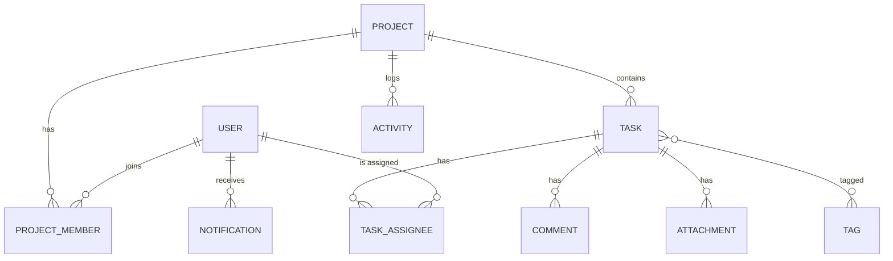
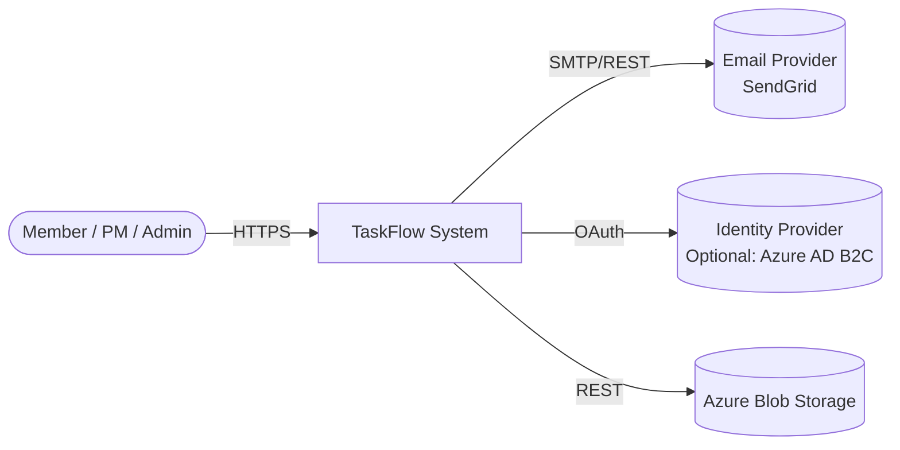
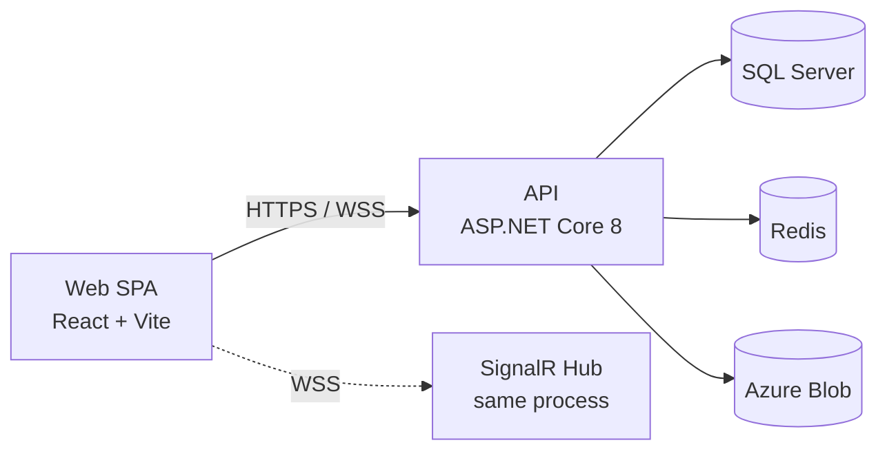

# Topic 1: Project Planning & Architecture Design

> Phase 6 builds **TaskFlow** — a project & task management SaaS — end-to-end. Before a single line of code is written, we plan. This topic teaches you **how senior engineers think before they type**.

---

## 1. Why Planning Comes Before Code

Engineers who skip planning ship features that:

- Don't match what the user actually needed.
- Are technically expensive to change later (database schemas, auth flows, public API contracts).
- Repeat costly decisions across the team because no one wrote down *why* the choice was made.

> **Why this matters:** Cost-of-change rises exponentially. Renaming a field in a design doc is free; renaming a column on a production database used by 50 consumers is a multi-week project.

A good plan answers four questions, in this order:

1. **Who is this for?** (users / personas)
2. **What problem are we solving?** (requirements)
3. **What does success look like?** (acceptance criteria + non-functionals)
4. **How will we build it?** (architecture, tech, process)

---

## 2. Stakeholders & Personas

Before requirements, list the people who care about the system.

| Stakeholder | Cares About | Wants From TaskFlow |
|---|---|---|
| End user (Member) | Personal productivity | Fast task entry, clear "what's mine today" |
| Project Manager | Team throughput | Project dashboards, due-date views, assignment |
| Admin / Org Owner | Governance, billing | User invites, role management, audit logs |
| Viewer (Stakeholder) | Read-only progress | Public/share links, status reports |
| Developer (us) | Maintainability | Clean APIs, test coverage, observability |
| Operations | Uptime, cost | Health endpoints, dashboards, runbooks |

Each persona becomes a lens for prioritization: *"Does this story serve a persona we care about?"*

---

## 3. Functional vs Non-Functional Requirements

| Type | Question it answers | TaskFlow examples |
|---|---|---|
| **Functional** | *What does the system do?* | "User can create a project", "Admin can invite a member by email" |
| **Non-Functional (NFR)** | *How well does it do it?* | "P95 list API < 250 ms with 10 k tasks", "99.5% monthly uptime", "GDPR delete in 30 days" |

NFRs to capture for TaskFlow MVP:

- **Performance**: P95 < 300 ms for list endpoints, < 100 ms for cached lookups.
- **Scalability**: Support 1 000 concurrent users; design path to 10 000.
- **Availability**: 99.5 % monthly. Single-region OK for MVP.
- **Security**: OWASP Top 10 mitigations, JWT + refresh tokens, BCrypt/Argon2.
- **Privacy**: PII minimization, soft delete + 30-day purge, EU-region data residency option.
- **Accessibility**: WCAG 2.1 AA on web client.
- **Observability**: Structured logs with correlation IDs, OpenTelemetry traces, health checks.
- **Internationalization**: ISO timestamps, UTC storage, i18n-ready strings (English-only at MVP).

> **Anti-pattern:** Treating NFRs as "we'll do them at the end". They drive architecture (caching, sharding, security boundaries). Capture them in the same sprint as features.

---

## 4. Writing User Stories

**Connextra format:**

> **As a** `<persona>`, **I want** `<capability>`, **so that** `<benefit>`.

Pair each story with **acceptance criteria** in *Given / When / Then* (Gherkin):

```
Scenario: Member creates a task in a project they belong to
  Given I am authenticated as a Member of project "Apollo"
  When I POST /projects/{apolloId}/tasks with { title: "Wire OAuth" }
  Then the response is 201 Created
  And the task appears in GET /projects/{apolloId}/tasks
  And an "task.created" activity entry is recorded
```

### TaskFlow MVP Stories (sample 10)

| # | As a | I want to | So that |
|---|---|---|---|
| US-01 | Visitor | Sign up with email + password | I can create my own workspace |
| US-02 | User | Log in and refresh my token silently | I stay signed in without re-typing my password |
| US-03 | Org Owner | Invite a user by email and role | They can join my org with the right permissions |
| US-04 | PM | Create a project with name, description, due date | I can group related work |
| US-05 | Member | Create / edit / delete a task within a project I belong to | I can capture work to do |
| US-06 | Member | Assign a task to one or more project members | Responsibility is explicit |
| US-07 | Member | Comment on a task | Discussion stays attached to the work |
| US-08 | Member | Upload an attachment to a task | Reference docs live with the task |
| US-09 | PM | Filter tasks by status, assignee, tag, due-date range | I can find what matters now |
| US-10 | Anyone | See live updates when a teammate changes a task in the same project | I don't work on stale data |

> **Tip:** Keep stories to a vertical slice — UI + API + DB — not a layer.

---

## 5. Prioritization with MoSCoW

Split the backlog into **Must / Should / Could / Won't (this release)**.

| Bucket | TaskFlow scope |
|---|---|
| **Must** (MVP) | Auth (signup/login/refresh), org + invites, projects CRUD, tasks CRUD with status/assignee/due/tags, comments, attachments, basic listing with filter+pagination, audit trail, web client for all of the above |
| **Should** | Real-time updates via SignalR, email notifications, password reset, basic analytics dashboard, dark mode |
| **Could** | Recurring tasks, calendar view, Slack integration, public share links |
| **Won't (yet)** | Mobile native apps, offline mode, multi-language UI, custom fields engine, marketplace plugins |

**MVP scope statement** (one paragraph the team agrees on):

> *TaskFlow MVP lets a small team sign up, create projects, manage tasks (CRUD + assign + comment + attach), and view filtered lists with audit trail. It supports JWT auth with refresh, runs on Azure App Service + SQL Server + Blob Storage, and ships behind a CI/CD pipeline with health checks and structured logs.*

---

## 6. Domain Modeling

Identify entities, then group them into **aggregates** (consistency boundaries) and **bounded contexts** (model boundaries).

### TaskFlow entities



### Aggregates (DDD-lite)

| Aggregate root | Includes | Why root |
|---|---|---|
| `Project` | Project, ProjectMember | Membership invariants ("only owner can remove") live with project |
| `TaskItem` | TaskItem, TaskAssignee, Comment, Attachment, Tag links | Single transactional boundary for task changes |
| `User` | User, RefreshToken | Auth state lives with the user |

### Bounded contexts

- **Identity** — sign-up, login, tokens, password.
- **Collaboration** — projects, tasks, comments, attachments.
- **Notifications** — email + in-app + real-time.
- **Audit / Activity** — append-only log; consumed asynchronously.

> **Why this matters:** Bounded contexts hint at where you might split into separate services later. For MVP we keep them as **modules in a modular monolith**, not separate services — same database, separate folders.

---

## 7. C4 Model — Documenting Architecture

The C4 Model gives four zoom levels: **Context → Container → Component → Code**. We'll author levels 1 and 2.

### C1: System Context



### C2: Containers



> Author these diagrams in `docs/architecture/` as living documentation. Update them when reality changes.

---

## 8. Choosing the Tech Stack

| Concern | Choice | Why |
|---|---|---|
| Backend runtime | **.NET 8/9** | LTS, modern minimal APIs + MVC, strong tooling, course focus |
| Database | **SQL Server** (PostgreSQL acceptable) | Course is Microsoft-leaning; T-SQL + EF Core synergy; Azure SQL deploy parity |
| ORM | **EF Core 8/9** | Migrations, LINQ, change tracking, mature on SQL Server |
| Frontend | **React 18+ TS + Vite** | Phase 4 stack; ecosystem; SSR optional later |
| Real-time | **SignalR** | First-party in .NET; falls back to long-polling; scales with Redis backplane |
| Cache | **Redis** (StackExchange.Redis) | Distributed, well-supported, cheap at scale |
| Storage | **Azure Blob** | Cheap, durable, signed URLs for direct upload |
| Auth | **JWT + refresh tokens (own issuer)** for MVP; option to swap to Azure AD B2C later | Full control, course teaches the internals |
| CI/CD | **GitHub Actions** | Free for public, native to GitHub, YAML pipelines |
| Hosting | **Azure App Service** (API) + **Azure Static Web Apps** (web) | Simple, managed, integrates with Key Vault |

Keep this table in `docs/architecture/tech-stack.md` and update with every change.

---

## 9. Architecture Styles — Compare and Pick

| Style | Pros | Cons | Use when |
|---|---|---|---|
| **Layered (N-tier)** | Familiar, simple | Easy to leak DB types up | Small teams, simple domains |
| **Clean / Onion** | Domain at center, testable | Indirection upfront | Anything that will grow |
| **Vertical Slice** | Each feature self-contained | Cross-feature concerns harder | Lots of independent features |
| **Modular Monolith** | One deploy, clear modules | Still one DB | MVP that will likely grow into services |
| **Microservices** | Independent scale + deploy | Distributed-systems tax | Multiple teams, mature ops |

**TaskFlow choice:** **Modular Monolith with Clean Architecture inside**. We get fast iteration, one deploy, *and* clear seams to split later. Modules: `Identity`, `Collaboration`, `Notifications`, `Audit`. Each has its own folder + DbContext partial + endpoints.

---

## 10. Repository Strategy

| Strategy | Pros | Cons |
|---|---|---|
| **Polyrepo** | Independent versioning, smaller checkouts | Cross-repo refactors painful |
| **Monorepo (Nx, Turborepo, Pants)** | Atomic cross-cutting changes, shared tooling | Bigger checkout, needs build cache discipline |

**TaskFlow choice:** **Single repo** with two top-level apps (`api/`, `web/`). Not a tooled monorepo (no Nx) — just plain folders. We get atomic PRs that change API contract + frontend client at once.

### Folder layout

```
TaskFlow/
  api/                      # .NET solution root
    src/
      TaskFlow.Api/
      TaskFlow.Application/
      TaskFlow.Domain/
      TaskFlow.Infrastructure/
      TaskFlow.Contracts/   # shared DTOs (optional, see ADR-002)
    tests/
      TaskFlow.UnitTests/
      TaskFlow.IntegrationTests/
  web/                      # React app
    src/
      app/
      features/
      shared/
      api-client/           # generated from OpenAPI
    tests/
  infra/                    # Terraform / Bicep / docker-compose
  .github/
    workflows/
    ISSUE_TEMPLATE/
    PULL_REQUEST_TEMPLATE.md
  docs/
    architecture/
      adr/                  # ADR-0001-*.md
      c4/
      tech-stack.md
    runbooks/
  README.md
  CONTRIBUTING.md
```

---

## 11. Architecture Decision Records (ADRs)

ADRs are **short, immutable** notes capturing *why* a decision was made. Format:

```
# ADR-0001: Use JWT with rotating refresh tokens
Status: Accepted
Date: 2026-01-15
Context: ... (problem, constraints)
Decision: ... (chosen approach)
Consequences: ... (good + bad)
Alternatives considered: ...
```

### ADR-0001 — Auth Strategy (excerpt)

- **Context:** MVP needs sign-up + login without an external IdP dependency. Must support mobile clients later.
- **Decision:** Issue our own JWT access tokens (15 min) + opaque refresh tokens (7 days, rotating, persisted). Hash passwords with BCrypt cost 12.
- **Consequences (+):** No external dependency; full control of claims. **(-):** We own key rotation, revocation, and breach response.
- **Alternatives:** Azure AD B2C (rejected for MVP cost + setup time), cookies-only (rejected: harder for mobile).

### ADR-0002 — Shared Contracts Project

- **Context:** Frontend needs DTO types matching the API.
- **Decision:** Generate the TS client from OpenAPI (`openapi-typescript-codegen`) at build time. **No** shared C# project consumed by web.
- **Consequences:** Single source of truth = the running API's swagger; web build fails on drift; no awkward cross-language project.

### ADR-0003 — Database Engine

- **Context:** Need transactional store, integrates with EF Core, deployable on Azure.
- **Decision:** SQL Server (Azure SQL in prod, LocalDB / Docker in dev).
- **Consequences:** First-class EF Core support, T-SQL skills transfer; vendor-locked vs PG.

> Store every ADR in `docs/architecture/adr/ADR-NNNN-title.md`. Never edit accepted ADRs — supersede with a new one.

---

## 12. API Contract-First Thinking

Decide **what the API looks like** before writing controllers.

- **Format:** OpenAPI 3.1 in `docs/api/openapi.yaml` (also generated by Swashbuckle at runtime).
- **Versioning:** URL segment `/api/v1/...`. New major version when breaking; minor changes additive.
- **Error model:** RFC 7807 `application/problem+json`:
  ```json
  {
    "type": "https://taskflow.app/errors/validation",
    "title": "One or more validation errors occurred.",
    "status": 422,
    "errors": { "title": ["Required"] },
    "traceId": "00-abc..."
  }
  ```
- **Pagination:** Offset for MVP (`?page=&pageSize=`), keyset for activity log.
- **IDs:** UUID v7 (sortable) in URLs and bodies; never int auto-increment in the public surface.

---

## 13. Security & Compliance — Early, Not Late

### STRIDE threat-modeling pass

| Threat | Where it bites | Mitigation in MVP |
|---|---|---|
| **S**poofing | Login | Strong password policy, BCrypt, login throttling, generic "invalid credentials" |
| **T**ampering | Tokens, file uploads | JWT signature + short TTL; signed upload URLs; checksum on attachments |
| **R**epudiation | Who deleted that task? | Append-only Activity log with userId + traceId |
| **I**nformation disclosure | Cross-tenant leakage | Every query filters by `OrgId`; integration test enforces it |
| **D**enial of service | Public endpoints, large lists | Rate limiting, page-size caps, request body size caps |
| **E**levation of privilege | Member acting as Admin | Policy-based authorization at handler level + integration tests |

### Data classification

| Class | Examples | Handling |
|---|---|---|
| Public | Org name | OK to log |
| Internal | Project names, task titles | Not in non-prod logs |
| Confidential | Passwords, refresh tokens, PII | Never logged; hashed/encrypted at rest |

Capture **GDPR** basics: right to access (export), right to be forgotten (soft-delete + 30-day purge job).

---

## 14. Definition of Ready / Done

A story is **Ready** when:

- It has a clear user, capability, and value.
- Acceptance criteria are testable.
- Non-functional impact is considered.
- Dependencies (other stories, infra) are noted.

A story is **Done** when:

- All acceptance criteria pass automated tests.
- Code merged to `main` via PR with at least one review.
- Documentation updated (README, ADR if applicable).
- Telemetry added (log + metric + trace span).
- Feature behind a flag where risky.
- Deployed to staging.

---

## 15. Estimation

For a solo learner, fancy point systems are overkill, but **t-shirt sizing** keeps you honest:

| Size | Effort | Example |
|---|---|---|
| XS | < 2 h | Add a config value |
| S | half day | New simple endpoint |
| M | 1–2 days | Feature with UI + API + DB |
| L | 3–5 days | Auth flow, real-time wiring |
| XL | > 1 week | Split it. |

If a story is L or XL, **decompose** before starting.

---

## 16. Process — Lite Agile for One

- **Backlog** in GitHub Issues with labels: `type:story`, `type:bug`, `area:api`, `area:web`, `priority:must`, etc.
- **Iteration**: 1-week loop. Pick a small batch on Monday, demo to yourself Friday.
- **Board**: GitHub Projects with columns *Backlog → Ready → In Progress → Review → Done*.
- **Branching**: trunk-based — short-lived feature branches off `main`, merged via PR. PRs require green CI.
- **Commits**: Conventional Commits (`feat: …`, `fix: …`) — drives automatic CHANGELOG later.

### Issue / PR templates

`.github/ISSUE_TEMPLATE/feature.md`:

```
**Story**
As a ... I want ... so that ...

**Acceptance criteria**
- [ ] ...

**NFR impact**
- Performance:
- Security:
- Observability:
```

---

## 17. Risk Register

| # | Risk | Likelihood | Impact | Mitigation |
|---|---|---|---|---|
| R1 | EF Core migrations diverge between dev and prod | M | H | Idempotent SQL scripts in CI, drift check |
| R2 | JWT secret leak | L | H | Key Vault, rotation playbook |
| R3 | N+1 queries in listing endpoints | H | M | Projection + integration test asserting query count |
| R4 | Frontend bundle bloat | M | M | Bundle budget in CI, code-split routes |
| R5 | SignalR scale-out without backplane | M | H | Redis backplane wired before > 1 instance |

---

## 18. Common Pitfalls / Anti-Patterns

| Pitfall | What goes wrong | Fix |
|---|---|---|
| "We'll write tests later" | Bugs ship to prod, fear of refactoring | Test-first for handlers + integration coverage from day 1 |
| Designing the DB after the UI | Data model fights the screens | Domain model first, then UI |
| Sharing entities as DTOs | Over-fetching, leaking nav props | Always project to DTO |
| Premature microservices | Distributed monolith | Start modular monolith, split later if needed |
| Tribal knowledge | Decisions lost when team changes | ADRs |
| No correlation IDs | Untraceable bugs across web + api | Generate at edge, propagate everywhere |

---

## 19. Interview Q&A

**Q1. Why ADRs over a wiki page?** Immutability + chronology — you see the *evolution* of decisions, including superseded ones.

**Q2. Difference between functional and non-functional requirements?** Functional = *what* the system does; non-functional = *how well* (performance, security, availability). NFRs drive architecture more than features do.

**Q3. When would you NOT use a monorepo?** When sub-projects have independent release cadences and minimal cross-cutting changes — the monorepo tooling cost outweighs the atomic-PR benefit.

**Q4. What's a bounded context?** A boundary in which a model is consistent and unambiguous. Terms can mean different things in different contexts; cross-context communication uses translations.

**Q5. C4 Model purpose?** A standardized way to communicate architecture at multiple zoom levels so different audiences (exec → developer) get the right detail.

**Q6. Trunk-based vs Gitflow?** Trunk-based: short-lived branches, integrate to `main` daily, feature flags for unfinished work. Gitflow: long-lived `develop`/`release` branches. Trunk-based wins for CD.

**Q7. RFC 7807?** Standard for HTTP error responses with `type`, `title`, `status`, `detail`, `instance`, plus extensions. Lets clients reason about errors uniformly.

**Q8. Why STRIDE before coding?** Identifying threat categories (Spoofing/Tampering/etc.) shapes architectural choices — placement of auth, audit logging, rate limits — that are expensive to retrofit.

**Q9. Estimation: story points or hours?** Points abstract over individual speed and reduce arguing about "exact" durations. Hours appear in t-shirt sizing rules of thumb only.

**Q10. What's a Definition of Done meant to prevent?** "Works on my machine" merges. It encodes shared expectations: tests, docs, telemetry, deploy.

---

## 20. Further Reading

- Simon Brown — *The C4 Model for Software Architecture* (c4model.com)
- Eric Evans — *Domain-Driven Design*
- Vaughn Vernon — *Implementing Domain-Driven Design*
- Michael Nygard — *Documenting Architecture Decisions* (the original ADR post)
- Mark Richards & Neal Ford — *Fundamentals of Software Architecture*
- OWASP — *Application Security Verification Standard (ASVS)*
- Gregor Hohpe — *The Architect Elevator*

---

> **Done with planning when:** you have personas, stories with acceptance criteria, MoSCoW scope, an ERD, C1+C2 diagrams, a tech stack table, 3+ ADRs, and a one-paragraph MVP scope statement. Now we can code.
