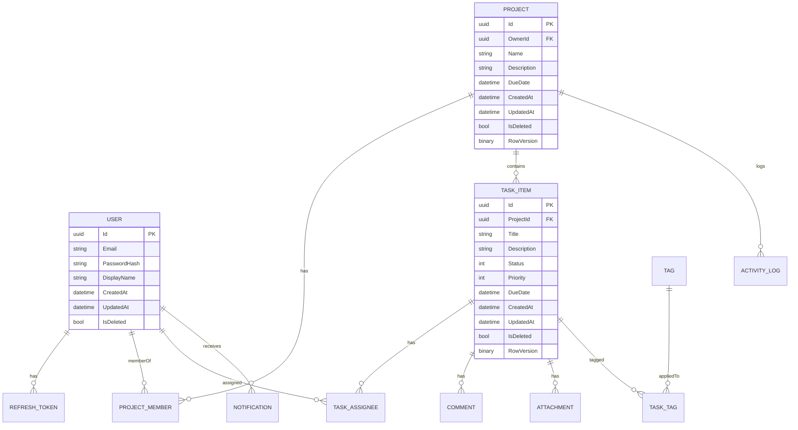

# Topic 2: Database Design & EF Core Migrations

> Before TaskFlow can store anything, we design the schema. This topic moves from **conceptual modeling** through **physical schema** to **EF Core code-first** with production-grade migrations.

---

## 1. Goals of Database Design

1. **Integrity** — the DB never holds invalid state, even on bug or crash.
2. **Performance** — the most common queries run in milliseconds, not seconds.
3. **Evolvability** — the schema can change *without* downtime as the product grows.

A schema that scores well on integrity but poorly on performance pushes load onto the application; one that scores well on performance but ignores integrity grows quiet bugs forever. Aim for all three.

---

## 2. SQL Server vs PostgreSQL — Quick Trade-off

| Concern | SQL Server | PostgreSQL |
|---|---|---|
| Native EF Core support | First-class | First-class via Npgsql |
| Cost (cloud) | Azure SQL paid tiers | Free in-cloud (cheaper hosted offerings) |
| JSON support | `nvarchar(max)` + JSON functions | Native `jsonb` with indexes |
| Full-text | Built-in catalog | `tsvector` / `pg_trgm` |
| Sequences/identity | `IDENTITY` | `SEQUENCE` / `IDENTITY` |
| Casing | Case-insensitive default | Case-sensitive default |
| Course choice | ✅ TaskFlow uses this | Acceptable substitute |

We use **SQL Server**. Code stays portable to PostgreSQL by avoiding T-SQL-specific features.

---

## 3. Normalization Recap

| Normal Form | Rule | TaskFlow example |
|---|---|---|
| **1NF** | Atomic columns, no repeating groups | Don't store `tags` as `"bug,urgent"` in one column |
| **2NF** | No partial dependencies on a composite key | If PK is `(taskId, userId)`, all non-key columns depend on the *whole* PK |
| **3NF** | No transitive dependencies | Don't store `projectName` on `Task` — derive via `projectId` join |

**When to denormalize:**

- Read-heavy listing endpoints where the join cost dominates.
- Materialized counters (`Project.OpenTaskCount`) when computed on demand is too slow.
- Audit / activity logs are intentionally denormalized — they capture a snapshot.

> **Rule of thumb:** Normalize first, denormalize *after* a measured perf problem and only behind explicit invalidation logic.

---

## 4. ER Modeling for TaskFlow



(Truncated — `Comment`, `Attachment`, `Notification`, `ActivityLog`, `Tag`, `TaskTag`, `ProjectMember`, `RefreshToken`, `TaskAssignee` all follow the same pattern.)

### Cardinalities at a glance

- **User ↔ Project** is many-to-many through `ProjectMember` (carries `Role`, `JoinedAt`).
- **Task ↔ User** (assignees) is many-to-many through `TaskAssignee`.
- **Task ↔ Tag** is many-to-many through `TaskTag` (no extra columns → can use skip navigation).
- **Project → ActivityLog** is one-to-many; activity is append-only.

---

## 5. Surrogate vs Natural Keys

| Choice | Pros | Cons |
|---|---|---|
| `int IDENTITY` | Tiny (4-8 B), fast, sequential, ideal for clustered index | Predictable IDs leak count info; not safe in URLs |
| `Guid` (V4 random) | Globally unique, safe in URLs, generatable client-side | Random → fragments clustered indexes, larger (16 B) |
| `Guid` v7 / `NEWSEQUENTIALID()` | Time-ordered, friendly to clustered index | Slightly leaks creation order (often acceptable) |

**TaskFlow rule:** Public-facing entity IDs are **UUID v7** (sortable). Internal lookup tables (e.g., `EnumLookup`) can be `int`.

In .NET 9+ you have `Guid.CreateVersion7()`; otherwise use a polyfill or `NEWSEQUENTIALID()` default in SQL.

---

## 6. Indexing Strategy

### Index types

| Type | Use when |
|---|---|
| **Clustered** (one per table) | Defines physical order. Pick a narrow, ever-increasing key — usually the PK |
| **Nonclustered** | All other indexes — secondary lookups |
| **Unique** | Enforce uniqueness (email, refresh-token hash) |
| **Filtered** | `WHERE IsDeleted = 0` — avoid indexing soft-deleted rows |
| **Covering** | Add `INCLUDE` columns so a query is satisfied without touching the heap |
| **Composite** | Multi-column; column order matters (most-selective first, or matching `WHERE` order) |

### TaskFlow indexing

| Table | Index | Reason |
|---|---|---|
| `User` | `UNIQUE(Email)` filtered `WHERE IsDeleted = 0` | Login lookup, prevent duplicates |
| `RefreshToken` | `UNIQUE(TokenHash)` | Lookup on refresh |
| `Project` | `IX_Project_OwnerId_CreatedAt` | List "my projects" by recency |
| `ProjectMember` | `UNIQUE(ProjectId, UserId)` | One membership per user |
| `TaskItem` | `IX_Task_ProjectId_Status_DueDate INCLUDE(Title, Priority)` | Powers default board view |
| `ActivityLog` | `IX_Activity_ProjectId_OccurredAt` | Time-ordered list |
| `Notification` | `IX_Notif_UserId_ReadAt` filtered `WHERE ReadAt IS NULL` | Unread badge |

### Anti-patterns

- One nonclustered index per column ("over-indexing") — slows writes, bloats storage.
- Indexing every FK without checking actual query patterns.
- Forgetting that the clustered key is included in **every** nonclustered index — wide PKs hurt.

---

## 7. Constraints

| Constraint | Used for | Example |
|---|---|---|
| `PRIMARY KEY` | Row identity | `Id uuid PK` |
| `FOREIGN KEY` | Referential integrity | `ProjectId → Project(Id)` |
| `UNIQUE` | Business rule | `User.Email` |
| `CHECK` | Domain rule | `CHECK (Priority BETWEEN 0 AND 4)` |
| `DEFAULT` | Default value | `CreatedAt DEFAULT SYSUTCDATETIME()` |
| `NOT NULL` | Required field | `Title NVARCHAR(200) NOT NULL` |

In EF Core fluent:

```csharp
builder.Property(t => t.Title).IsRequired().HasMaxLength(200);
builder.Property(t => t.Priority).HasConversion<int>();
builder.HasIndex(t => new { t.ProjectId, t.Status, t.DueDate })
       .IncludeProperties(t => new { t.Title, t.Priority });
builder.HasOne(t => t.Project).WithMany(p => p.Tasks)
       .HasForeignKey(t => t.ProjectId)
       .OnDelete(DeleteBehavior.Restrict); // do NOT cascade-delete tasks
```

> **Cascade rules:** Default `OnDelete(Cascade)` can produce *cycles* on multi-FK tables — SQL Server rejects them. Pick `Restrict` or `SetNull` deliberately.

---

## 8. Concurrency Control

| Strategy | When | EF Core wiring |
|---|---|---|
| **Optimistic via `RowVersion`** | Most updates | `[Timestamp]` byte[] property, EF auto-adds to UPDATE WHERE |
| **Optimistic via `ConcurrencyToken`** | Specific column | `IsConcurrencyToken()` |
| **Pessimistic** | Rare; long-running batch | `WITH (UPDLOCK, HOLDLOCK)` raw SQL |

```csharp
public byte[] RowVersion { get; set; } = default!;
// builder.Property(x => x.RowVersion).IsRowVersion();
```

A failed concurrent update throws `DbUpdateConcurrencyException` → API returns **412 Precondition Failed**.

---

## 9. Soft Delete Pattern

```csharp
public interface ISoftDelete { bool IsDeleted { get; set; } DateTime? DeletedAt { get; set; } }

modelBuilder.Entity<Project>().HasQueryFilter(p => !p.IsDeleted);
modelBuilder.Entity<TaskItem>().HasQueryFilter(t => !t.IsDeleted);
```

- All queries auto-filter deleted rows.
- Use `IgnoreQueryFilters()` to include them (admin / restore / GDPR purge).
- A scheduled job hard-deletes rows older than retention SLA (30 days).

---

## 10. Audit Columns + `SaveChangesInterceptor`

```csharp
public interface IAuditable
{
    DateTime CreatedAt { get; set; }
    DateTime UpdatedAt { get; set; }
    Guid? CreatedBy { get; set; }
    Guid? UpdatedBy { get; set; }
}

public sealed class AuditInterceptor(ICurrentUser currentUser, TimeProvider clock)
    : SaveChangesInterceptor
{
    public override ValueTask<InterceptionResult<int>> SavingChangesAsync(
        DbContextEventData ed, InterceptionResult<int> result, CancellationToken ct = default)
    {
        var ctx = ed.Context!;
        var now = clock.GetUtcNow().UtcDateTime;
        foreach (var e in ctx.ChangeTracker.Entries<IAuditable>())
        {
            if (e.State == EntityState.Added)
            {
                e.Entity.CreatedAt = now;
                e.Entity.CreatedBy = currentUser.Id;
            }
            if (e.State is EntityState.Added or EntityState.Modified)
            {
                e.Entity.UpdatedAt = now;
                e.Entity.UpdatedBy = currentUser.Id;
            }
        }
        return base.SavingChangesAsync(ed, result, ct);
    }
}
// services.AddScoped<AuditInterceptor>();
// options.AddInterceptors(sp.GetRequiredService<AuditInterceptor>());
```

Why interceptor over overriding `SaveChanges`? **Composability** — you can stack multiple interceptors (audit, outbox, soft-delete) without touching the DbContext.

---

## 11. EF Core Setup

`TaskFlowDbContext.cs`:

```csharp
public sealed class TaskFlowDbContext(DbContextOptions<TaskFlowDbContext> options) : DbContext(options)
{
    public DbSet<User> Users => Set<User>();
    public DbSet<Project> Projects => Set<Project>();
    public DbSet<TaskItem> Tasks => Set<TaskItem>();
    // ...

    protected override void OnModelCreating(ModelBuilder mb)
    {
        mb.ApplyConfigurationsFromAssembly(typeof(TaskFlowDbContext).Assembly);
    }
}
```

Configurations live next to the class:

```csharp
public sealed class TaskItemConfig : IEntityTypeConfiguration<TaskItem>
{
    public void Configure(EntityTypeBuilder<TaskItem> b)
    {
        b.ToTable("TaskItem");
        b.HasKey(x => x.Id);
        b.Property(x => x.Title).IsRequired().HasMaxLength(200);
        b.Property(x => x.RowVersion).IsRowVersion();
        b.HasIndex(x => new { x.ProjectId, x.Status, x.DueDate })
         .IncludeProperties(x => new { x.Title, x.Priority });
        b.HasQueryFilter(x => !x.IsDeleted);
    }
}
```

> **Annotation vs Fluent:** Prefer fluent for anything beyond trivial — annotations don't express filtered indexes, owned types, or cascade behavior.

---

## 12. Owned Types & Value Objects

Reusable value-objects without their own table:

```csharp
public sealed class Money
{
    public decimal Amount { get; }
    public string Currency { get; }
    public Money(decimal amount, string currency) { Amount = amount; Currency = currency; }
}

builder.OwnsOne(p => p.Budget, b =>
{
    b.Property(m => m.Amount).HasColumnName("BudgetAmount");
    b.Property(m => m.Currency).HasColumnName("BudgetCurrency").HasMaxLength(3);
});
```

Owned types serialize into the parent table — perfect for `Address`, `Money`, coordinates.

---

## 13. Many-to-Many

```csharp
// Skip nav (no extra columns) — TaskItem ↔ Tag
builder.Entity<TaskItem>()
       .HasMany(t => t.Tags)
       .WithMany(g => g.Tasks)
       .UsingEntity("TaskTag");

// Explicit join entity (carries data) — Project ↔ User via ProjectMember
public sealed class ProjectMember
{
    public Guid ProjectId { get; set; }
    public Guid UserId { get; set; }
    public ProjectRole Role { get; set; }
    public DateTime JoinedAt { get; set; }
}
builder.Entity<ProjectMember>().HasKey(x => new { x.ProjectId, x.UserId });
```

---

## 14. Inheritance Mapping

| Strategy | Storage | Pros | Cons |
|---|---|---|---|
| **TPH** (default) | One table, discriminator column | Fast, simple | Wide nullable columns |
| **TPT** | Base + per-derived tables | Clean schema | Joins on every read |
| **TPC** | Per-concrete table only | No nulls, no joins | Awkward queries across hierarchy |

For TaskFlow's `Notification` (Email/InApp/Push subtypes) we use **TPH** — the per-subtype data is small and we filter by discriminator.

---

## 15. Query Patterns

```csharp
// Tracking (default) — change tracking on. Use for updates.
var task = await db.Tasks.FirstAsync(t => t.Id == id, ct);

// No-tracking — read-only fast path
var page = await db.Tasks.AsNoTracking()
    .Where(t => t.ProjectId == projectId)
    .OrderBy(t => t.DueDate)
    .Skip((page-1) * pageSize).Take(pageSize)
    .Select(t => new TaskListItemDto(t.Id, t.Title, t.Status, t.DueDate))
    .ToListAsync(ct);

// AsSplitQuery — avoid cartesian explosion when including multiple collections
var project = await db.Projects
    .Include(p => p.Members)
    .Include(p => p.Tasks)
    .AsSplitQuery()
    .FirstAsync(p => p.Id == id, ct);
```

> **Rule:** Listing endpoints — `AsNoTracking()` + `Select` to DTO.  Update flow — load tracked entity.

---

## 16. Migrations Workflow

```bash
dotnet ef migrations add InitialCreate -p Infrastructure -s Api -o Persistence/Migrations
dotnet ef database update -p Infrastructure -s Api
dotnet ef migrations remove -p Infrastructure -s Api
dotnet ef migrations script <fromName> <toName> -i -o ./scripts/db.sql
```

| Flag | Purpose |
|---|---|
| `-p` | Migrations project (where `DbContext` lives) |
| `-s` | Startup project (provides connection string) |
| `-i` | Idempotent script — safe to re-run |
| `-o` | Output path |

### Production migration strategies

**Expand → Migrate → Contract** is the safe shape for any non-trivial schema change:

1. **Expand:** Add new column nullable, deploy code that reads *both* old and new.
2. **Migrate:** Backfill data, deploy code that writes new and reads new.
3. **Contract:** Drop old column, deploy code that reads only new.

Never combine Expand + Contract in one migration when running blue-green or rolling deploys — old instances will crash.

---

## 17. Seeding

| Approach | When | How |
|---|---|---|
| `HasData(...)` | Static reference data (roles, statuses) | Tracked by migrations |
| Runtime seeder | Demo / dev sample data | `IHostedService` or `dotnet run --seed` |
| Migration script | One-off backfill | Custom SQL inside a migration |

Idempotency is non-negotiable — seeders must be safe to run twice.

---

## 18. Local Dev Database

| Option | Pros | Cons |
|---|---|---|
| **LocalDB** | Built into VS, zero-config | Windows-only, EOL plans for newer SQL versions |
| **SQL Server in Docker** | Same image as prod | Docker Desktop license / Linux container |
| **Testcontainers** | Per-test isolated DB | Slower test startup; great for integration tests |

`docker-compose.yml` excerpt:

```yaml
services:
  sql:
    image: mcr.microsoft.com/mssql/server:2022-latest
    environment:
      ACCEPT_EULA: "Y"
      MSSQL_SA_PASSWORD: "Your_strong_Pa55w0rd"
    ports: ["1433:1433"]
    volumes: [ "sql-data:/var/opt/mssql" ]
volumes:
  sql-data:
```

Connection string (user-secrets):

```
Server=localhost,1433;Database=TaskFlow;User Id=sa;Password=...;Encrypt=False;
```

---

## 19. Common Errors & Fixes

| Error | Cause | Fix |
|---|---|---|
| `The model for context has pending changes` | Code drift from snapshot | `dotnet ef migrations add <name>` |
| `Introducing FOREIGN KEY constraint may cause cycles` | Cascading deletes form a cycle | Set `OnDelete(Restrict)` on at least one edge |
| `The instance of entity type X cannot be tracked because another instance with the same key value is already being tracked` | Multiple instances same PK | Detach or `.AsNoTracking()` for queries |
| Cartesian explosion (huge result rows) | Multiple `Include` on collections | `AsSplitQuery()` |
| `SqlException: Conversion failed when converting date` | Wrong column type / TZ | Store UTC, use `datetime2`, never `datetime` for new design |

---

## 20. Performance & Diagnostics

- Log generated SQL: `optionsBuilder.LogTo(Console.WriteLine, LogLevel.Information)`.
- Capture query plan: SSMS *Include Actual Execution Plan* or `SET STATISTICS XML ON`.
- `EFCore.Toolkit` / `MiniProfiler.EntityFrameworkCore` in dev.
- Watch for: implicit conversions, `EXISTS` vs `IN`, missing indexes, key-lookup hot spots.
- Pooled `DbContext` (`AddPooledDbContextFactory`) for high-throughput backgrounds.

---

## 21. Security Notes

- EF parameterizes everything — **don't** concatenate strings into raw SQL.
- Use a **least-privilege** DB user in prod (no `db_owner`).
- Connection string in **User Secrets** dev / **Key Vault** prod, never in `appsettings.json` checked-in.
- Encrypt at rest (Azure SQL TDE on by default) and in transit (`Encrypt=True`, certificate validated).

---

## 22. Interview Q&A

**Q1. Difference between TPH and TPT?** TPH stores all subtypes in one table with a discriminator (fast, but wide nullable columns); TPT splits each subtype into its own table joined to base (clean schema, more joins).

**Q2. Why might you turn off tracking?** Performance — the change tracker isn't needed for read-only queries; saves CPU + memory.

**Q3. How does EF detect concurrency conflicts?** A `RowVersion`/timestamp column included in the `WHERE` of the generated UPDATE. If 0 rows affected → `DbUpdateConcurrencyException`.

**Q4. When use a filtered index?** When most rows match a condition you never query (e.g., `IsDeleted = 1`) — exclude them and shrink the index.

**Q5. Why pooled DbContext?** Avoids the cost of constructing the model + change tracker on every request; useful for high-RPS APIs.

**Q6. What is `AsSplitQuery()`?** Splits one query with multiple `Include` collections into multiple SQL queries to avoid cartesian explosion.

**Q7. Schema change strategy in zero-downtime deploys?** Expand → Migrate → Contract over multiple deploys.

**Q8. What's wrong with `Guid.NewGuid()` clustered keys?** Random GUIDs scatter inserts across pages → page splits, fragmentation. Use UUID v7 / `NEWSEQUENTIALID()`.

**Q9. Seed via `HasData` vs runtime seeder?** `HasData` for tracked reference data that ships with the app; runtime seeder for environment-specific demo data.

**Q10. How to test a `DbContext`?** Use Testcontainers SQL Server (real engine) or SQLite in-memory for fast smoke tests; in-memory provider is *deprecated guidance* due to behavior gaps.

---

## 23. Further Reading

- Microsoft — *EF Core docs* (`learn.microsoft.com/ef/core/`)
- Itzik Ben-Gan — *T-SQL Querying*
- Markus Winand — *Use the Index, Luke!* (use-the-index-luke.com)
- Jon P. Smith — *Entity Framework Core in Action*
- Vladimir Khorikov — *Refactoring to a Persistence Layer*
