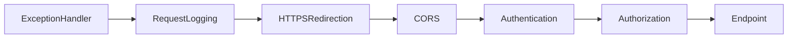

# Topic 3: Backend API Foundation

> Wire up the **TaskFlow.Api** solution from zero. Goal: a build-passing, swagger-browsable, structured-logged, health-checked, DI-cleanly-wired API ready to receive features.

---

## 1. Why "Foundation" First

Foundations are decisions that are **expensive to change later**: solution layout, DI conventions, configuration system, error model, logging, request pipeline. Get them wrong and every feature pays a tax forever. Get them right and feature work feels like Lego.

---

## 2. Solution Layout — Clean Architecture in Practice

```
api/
├── src/
│   ├── TaskFlow.Domain/           # entities, value objects, domain events, no deps
│   ├── TaskFlow.Application/      # use cases (CQRS handlers), DTOs, validators, abstractions
│   ├── TaskFlow.Infrastructure/   # EF Core, external services (email, blob), implementations
│   └── TaskFlow.Api/              # ASP.NET host, controllers/endpoints, middleware, DI
└── tests/
    ├── TaskFlow.UnitTests/
    └── TaskFlow.IntegrationTests/
```

**Dependency rule:** *Domain ← Application ← Infrastructure → Api*. Inner layers know nothing of outer ones.

| Layer | References | Knows About |
|---|---|---|
| Domain | nothing | entities, rules |
| Application | Domain | use cases, DTOs, contracts |
| Infrastructure | Application, Domain | EF, HTTP, file system, time |
| Api | Application, Infrastructure | HTTP routing, auth, swagger |

> **Why this matters:** The Domain stays unit-testable without DB, network, or framework. The Api remains the thin "delivery mechanism" layer.

---

## 3. .NET Hosting Model

`Program.cs` (.NET 8/9) is the entire bootstrap. It has three phases:

1. **Build** — `WebApplication.CreateBuilder(args)` → register services on `builder.Services`.
2. **Configure** — call `var app = builder.Build()` → register middleware in pipeline order.
3. **Run** — `app.Run()`.

```csharp
var builder = WebApplication.CreateBuilder(args);

// === SERVICES ===
builder.Host.UseSerilog((ctx, lc) => lc.ReadFrom.Configuration(ctx.Configuration));
builder.Services
    .AddTaskFlowDomain()
    .AddTaskFlowApplication()
    .AddTaskFlowInfrastructure(builder.Configuration)
    .AddTaskFlowApi(builder.Configuration);

var app = builder.Build();

// === PIPELINE ===
if (app.Environment.IsDevelopment()) app.UseSwagger().UseSwaggerUI();
app.UseExceptionHandler();
app.UseSerilogRequestLogging();
app.UseHttpsRedirection();
app.UseCors("Web");
app.UseAuthentication();
app.UseAuthorization();
app.MapHealthChecks("/health");
app.MapControllers();

app.Run();

public partial class Program { } // for WebApplicationFactory in tests
```

> **Why `partial Program`?** `WebApplicationFactory<Program>` in integration tests needs an accessible class. Top-level statements emit it as internal — making it `partial` exposes it for tests.

---

## 4. Configuration System — Layers & Precedence

ASP.NET Core merges multiple sources in order; **later wins**:

1. `appsettings.json`
2. `appsettings.{Environment}.json`
3. User Secrets (Development only)
4. Environment variables
5. Command-line args

```jsonc
// appsettings.json
{
  "ConnectionStrings": { "TaskFlow": "Server=...;" },
  "Jwt": {
    "Issuer": "https://taskflow.local",
    "Audience": "taskflow-api",
    "AccessTokenMinutes": 15,
    "RefreshTokenDays": 7
  },
  "Cors": { "AllowedOrigins": [ "https://app.taskflow.local" ] },
  "Serilog": { /* ... */ }
}
```

For secrets in dev:

```bash
dotnet user-secrets init --project src/TaskFlow.Api
dotnet user-secrets set "ConnectionStrings:TaskFlow" "Server=...;..."
dotnet user-secrets set "Jwt:SigningKey" "<32-byte-base64>"
```

In prod: **Azure Key Vault** referenced by App Service or Managed Identity-based.

---

## 5. Options Pattern — `IOptions<T>`, `IOptionsSnapshot<T>`, `IOptionsMonitor<T>`

| Variant | Lifetime | Reload on config change? |
|---|---|---|
| `IOptions<T>` | Singleton snapshot at startup | No |
| `IOptionsSnapshot<T>` | Scoped (per-request) | Yes (next request) |
| `IOptionsMonitor<T>` | Singleton with change tokens | Yes (immediate) |

**Strongly-typed config with validation:**

```csharp
public sealed class JwtOptions
{
    public const string SectionName = "Jwt";

    [Required] public string Issuer { get; init; } = default!;
    [Required] public string Audience { get; init; } = default!;
    [Range(1, 60)] public int AccessTokenMinutes { get; init; }
    [Range(1, 90)] public int RefreshTokenDays { get; init; }
    [Required, MinLength(32)] public string SigningKey { get; init; } = default!;
}

builder.Services
    .AddOptions<JwtOptions>()
    .Bind(builder.Configuration.GetSection(JwtOptions.SectionName))
    .ValidateDataAnnotations()
    .ValidateOnStart();
```

`ValidateOnStart()` fails the host on a misconfigured server — better than discovering it via a 500 at 2 AM.

---

## 6. DI Lifetimes — Deep Dive

| Lifetime | One instance per | TaskFlow examples |
|---|---|---|
| Singleton | Process | `IClock`, `IPasswordHasher`, options snapshots |
| Scoped | HTTP request | `DbContext`, `ICurrentUser`, MediatR pipeline behaviors |
| Transient | Every resolution | Lightweight stateless services, validators |

**Captive dependency** — a longer-lived service holding a shorter-lived one:

```csharp
// BAD — Singleton capturing a Scoped DbContext
services.AddSingleton<MyService>(); // takes DbContext in ctor → CRASH or stale state
```

ASP.NET Core's *scope validation* (default in Development) detects this at startup.

**Decorator pattern** (e.g., adding caching) is cleanest with **Scrutor**:

```csharp
services.AddScoped<IUserRepository, UserRepository>();
services.Decorate<IUserRepository, CachingUserRepository>();
```

---

## 7. Service Registration Conventions

Each layer exposes a single extension method on `IServiceCollection`:

```csharp
// TaskFlow.Application/DependencyInjection.cs
public static class DependencyInjection
{
    public static IServiceCollection AddTaskFlowApplication(this IServiceCollection services)
    {
        var asm = typeof(DependencyInjection).Assembly;
        services.AddMediatR(c => c.RegisterServicesFromAssembly(asm));
        services.AddValidatorsFromAssembly(asm);                       // FluentValidation
        services.AddAutoMapper(cfg => cfg.AddMaps(asm));               // AutoMapper
        services.AddTransient(typeof(IPipelineBehavior<,>), typeof(ValidationBehavior<,>));
        return services;
    }
}
```

This keeps `Program.cs` four lines instead of forty.

---

## 8. The HTTP Pipeline — Order Matters



| Middleware | Why this order |
|---|---|
| `UseExceptionHandler` | First so it catches everything below |
| `UseSerilogRequestLogging` | Below exception handler so it sees the final status code |
| `UseHttpsRedirection` | Before auth — never authenticate over HTTP |
| `UseCors` | Before auth so preflights aren't rejected |
| `UseAuthentication` | Populates `User` |
| `UseAuthorization` | Reads `User` to enforce policies |
| `MapControllers/MapHealthChecks` | Endpoints terminate the pipeline |

**Custom middleware** for correlation IDs:

```csharp
app.Use(async (ctx, next) =>
{
    var traceId = ctx.Request.Headers["X-Correlation-Id"].FirstOrDefault()
                  ?? Activity.Current?.TraceId.ToString()
                  ?? Guid.NewGuid().ToString("N");
    ctx.Response.Headers["X-Correlation-Id"] = traceId;
    using (Serilog.Context.LogContext.PushProperty("TraceId", traceId))
        await next();
});
```

---

## 9. Cross-Cutting: Logging with Serilog

```csharp
Log.Logger = new LoggerConfiguration()
    .Enrich.FromLogContext()
    .Enrich.WithMachineName()
    .Enrich.WithProperty("Service", "TaskFlow.Api")
    .WriteTo.Console(new RenderedCompactJsonFormatter())
    .WriteTo.OpenTelemetry(o => { o.Endpoint = "..."; })
    .CreateBootstrapLogger();
```

- **Bootstrap logger** = available before DI is built; replaced once `UseSerilog` runs.
- **Structured properties** > string interpolation: `Log.Information("User {UserId} logged in", id);` — searchable.
- Keep PII out of logs. Wrap user emails in a custom `Destructurer` if needed.

---

## 10. Global Error Handling (RFC 7807)

`.NET 8` introduced `IExceptionHandler`:

```csharp
public sealed class GlobalExceptionHandler(IProblemDetailsService pd) : IExceptionHandler
{
    public async ValueTask<bool> TryHandleAsync(HttpContext ctx, Exception ex, CancellationToken ct)
    {
        var (status, title) = ex switch
        {
            ValidationException        => (StatusCodes.Status422UnprocessableEntity, "Validation failed"),
            NotFoundException          => (StatusCodes.Status404NotFound, "Resource not found"),
            ForbiddenException         => (StatusCodes.Status403Forbidden, "Forbidden"),
            DbUpdateConcurrencyException => (StatusCodes.Status412PreconditionFailed, "Concurrency conflict"),
            _                          => (StatusCodes.Status500InternalServerError, "Server error")
        };
        ctx.Response.StatusCode = status;
        return await pd.TryWriteAsync(new()
        {
            HttpContext = ctx,
            ProblemDetails = new() { Title = title, Status = status }
        });
    }
}
builder.Services.AddExceptionHandler<GlobalExceptionHandler>().AddProblemDetails();
```

> Always include `traceId` in the response so support can correlate with logs.

---

## 11. API Versioning

```csharp
builder.Services
    .AddApiVersioning(o =>
    {
        o.DefaultApiVersion = new ApiVersion(1, 0);
        o.ReportApiVersions = true;
        o.ApiVersionReader = new UrlSegmentApiVersionReader();
    })
    .AddApiExplorer(o =>
    {
        o.GroupNameFormat = "'v'V";
        o.SubstituteApiVersionInUrl = true;
    });
```

Routes become `/api/v{version:apiVersion}/projects`. Breaking changes → bump major; additive changes within the same major version.

---

## 12. Swagger / OpenAPI

```csharp
builder.Services.AddSwaggerGen(c =>
{
    c.AddSecurityDefinition("Bearer", new()
    {
        Type = SecuritySchemeType.Http, Scheme = "bearer", BearerFormat = "JWT"
    });
    c.AddSecurityRequirement(new()
    {
        [new() { Reference = new() { Id = "Bearer", Type = ReferenceType.SecurityScheme } }] = []
    });
    c.IncludeXmlComments(Path.Combine(AppContext.BaseDirectory, "TaskFlow.Api.xml"));
});
```

Enable XML doc generation in `.csproj`:

```xml
<GenerateDocumentationFile>true</GenerateDocumentationFile>
<NoWarn>$(NoWarn);CS1591</NoWarn>
```

In .NET 9+, prefer the built-in `Microsoft.AspNetCore.OpenApi` package + `Scalar.AspNetCore` for a modern UI.

---

## 13. Health Checks

```csharp
builder.Services.AddHealthChecks()
    .AddDbContextCheck<TaskFlowDbContext>("db")
    .AddRedis(builder.Configuration.GetConnectionString("Redis")!, "redis")
    .AddCheck<SmokeCheck>("smoke");

app.MapHealthChecks("/health/live",  new() { Predicate = _ => false });
app.MapHealthChecks("/health/ready", new() { Predicate = c => c.Tags.Contains("ready") });
```

- `/health/live` — *am I running?* (always returns 200).
- `/health/ready` — *can I serve traffic?* (db, redis, blob reachable).
- Tag your checks with `"ready"` so the readiness endpoint filters correctly.

---

## 14. HttpClient Factory + Typed Clients

```csharp
services.AddHttpClient<EmailClient>(c =>
{
    c.BaseAddress = new Uri(opts.EmailBaseUrl);
    c.Timeout = TimeSpan.FromSeconds(10);
})
.AddPolicyHandler(HttpPolicyExtensions
    .HandleTransientHttpError()
    .WaitAndRetryAsync(3, _ => TimeSpan.FromSeconds(2)));
```

- Reuses sockets — avoids the famous *socket exhaustion* bug from `new HttpClient()` per call.
- Pair with **Polly** for retry, circuit-breaker, timeout policies.

---

## 15. MediatR + CQRS Scaffolding

```csharp
public sealed record CreateProjectCommand(string Name, string? Summary) : IRequest<Result<Guid>>;

public sealed class CreateProjectHandler(TaskFlowDbContext db, ICurrentUser user)
    : IRequestHandler<CreateProjectCommand, Result<Guid>>
{
    public async Task<Result<Guid>> Handle(CreateProjectCommand cmd, CancellationToken ct)
    {
        var p = new Project { Id = Guid.CreateVersion7(), OwnerId = user.Id, Name = cmd.Name, Summary = cmd.Summary };
        db.Projects.Add(p);
        await db.SaveChangesAsync(ct);
        return Result.Ok(p.Id);
    }
}
```

`ValidationBehavior<,>` runs FluentValidation **before** the handler:

```csharp
public sealed class ValidationBehavior<TReq, TResp>(IEnumerable<IValidator<TReq>> validators)
    : IPipelineBehavior<TReq, TResp> where TReq : notnull
{
    public async Task<TResp> Handle(TReq req, RequestHandlerDelegate<TResp> next, CancellationToken ct)
    {
        var ctx = new ValidationContext<TReq>(req);
        var failures = (await Task.WhenAll(validators.Select(v => v.ValidateAsync(ctx, ct))))
            .SelectMany(r => r.Errors).Where(f => f != null).ToList();
        if (failures.Count > 0) throw new ValidationException(failures);
        return await next();
    }
}
```

---

## 16. Result Pattern vs Exceptions

| Approach | When |
|---|---|
| `Result<T>` (no exception) | Expected business outcomes (validation, not-found, conflict) |
| Exceptions | Truly exceptional (DB down, bug, unhandled state) |

Throwing for control flow is expensive (stack capture). Use exceptions sparingly; reserve them for "I cannot continue".

---

## 17. AutoMapper

```csharp
public sealed class ProjectMappings : Profile
{
    public ProjectMappings()
    {
        CreateMap<Project, ProjectDto>();
        CreateMap<CreateProjectCommand, Project>();
    }
}
services.AddAutoMapper(cfg => cfg.AddMaps(typeof(ProjectMappings).Assembly));
```

For maximum perf with no reflection at runtime, switch to **Mapperly** (source generator).

---

## 18. DbContext Wire-up

```csharp
services.AddDbContext<TaskFlowDbContext>((sp, opts) =>
{
    opts.UseSqlServer(cfg.GetConnectionString("TaskFlow"), sql =>
    {
        sql.EnableRetryOnFailure(3);
        sql.CommandTimeout(30);
    });
    opts.AddInterceptors(sp.GetRequiredService<AuditInterceptor>());
    if (env.IsDevelopment()) opts.EnableSensitiveDataLogging();
});
services.AddScoped<AuditInterceptor>();
```

For high-throughput scenarios use `AddPooledDbContextFactory<TaskFlowDbContext>`.

---

## 19. Conditional Registration by Environment

```csharp
if (env.IsDevelopment())
    services.AddScoped<IEmailSender, ConsoleEmailSender>();
else
    services.AddScoped<IEmailSender, SendGridEmailSender>();
```

Or feature-flag style:

```csharp
if (cfg.GetValue<bool>("Features:UseRedisCache"))
    services.AddStackExchangeRedisCache(o => o.Configuration = cfg.GetConnectionString("Redis"));
else
    services.AddDistributedMemoryCache();
```

---

## 20. Local Dev Experience

`launchSettings.json` only matters for **dev**. Keep it minimal and never check secrets in:

```jsonc
{
  "profiles": {
    "TaskFlow.Api": {
      "commandName": "Project",
      "applicationUrl": "https://localhost:7088",
      "environmentVariables": { "ASPNETCORE_ENVIRONMENT": "Development" }
    }
  }
}
```

`dotnet watch run --project src/TaskFlow.Api` for hot reload.

Trust the dev cert once: `dotnet dev-certs https --trust`.

---

## 21. Containerization Preview

What `Program.cs` needs to support running in a container behind a reverse proxy:

```csharp
builder.WebHost.ConfigureKestrel(o => o.ListenAnyIP(8080));
builder.Services.Configure<ForwardedHeadersOptions>(o =>
{
    o.ForwardedHeaders = ForwardedHeaders.XForwardedFor | ForwardedHeaders.XForwardedProto;
    o.KnownNetworks.Clear(); o.KnownProxies.Clear(); // trust the platform
});
app.UseForwardedHeaders();
```

Topic 12 covers the Dockerfile, image hardening, and Azure deploy.

---

## 22. Common Pitfalls

| Pitfall | Symptom | Fix |
|---|---|---|
| `app.UseAuthentication()` after `app.UseEndpoints` | All endpoints anonymous | Order matters; auth before authorization |
| Singleton resolving Scoped via `IServiceProvider.GetRequiredService` | Captive dependency | Inject `IServiceScopeFactory`, create scope per use |
| Logging the whole request body | Leaks PII / huge logs | Allow-list specific properties, log size only |
| `Configure<T>` without `ValidateOnStart` | Misconfig discovered in prod 500 | Always validate on start |
| Hardcoding `https://localhost:5001` in clients | CORS / env drift | Use config + `IConfiguration[".."]` |

---

## 23. Interview Q&A

**Q1. What's the dependency rule in Clean Architecture?** Outer layers may depend on inner; inner never on outer. Concrete: Api → Infra → App → Domain. Domain knows about nothing else.

**Q2. Difference between IOptions, IOptionsSnapshot, IOptionsMonitor?** Singleton/Scoped/Singleton-with-change-token; reload behavior changes accordingly.

**Q3. Why `ValidateOnStart()`?** Fail fast at boot when config is wrong, instead of discovering it via runtime 500s.

**Q4. Why `partial Program {}` for tests?** `WebApplicationFactory<Program>` requires a non-internal class reference; partial exposes the auto-generated one.

**Q5. What's a captive dependency?** A long-lived service holding a shorter-lived dependency, causing stale state or instance leaks. ASP.NET's scope validator catches it in dev.

**Q6. Where should exception handling live?** A single `IExceptionHandler` (or middleware) at the top of the pipeline that produces RFC 7807 `ProblemDetails`.

**Q7. Why is middleware order important?** Each middleware wraps the next; mis-ordering makes one or the other ineffective (e.g., logging that misses status, auth that runs after authz).

**Q8. Bootstrap logger?** A logger usable before DI is built (`CreateBootstrapLogger`), captured early so failures during startup are still observable.

**Q9. Health checks: live vs ready vs startup?** Live = process up; Ready = can serve traffic (deps OK); Startup = used by orchestrators while the app is still warming up.

**Q10. When to choose Result over exceptions?** For expected business outcomes (validation, not-found). Exceptions remain for unexpected failures only.

---

## 24. Further Reading

- Steve Smith — *Clean Architecture .NET solution template* (Ardalis)
- Andrew Lock — `andrewlock.net` posts on configuration & DI
- Microsoft — *ASP.NET Core fundamentals* docs
- Polly docs (resilience patterns)
- Serilog docs + *Tomas Hartman's logging tips*
