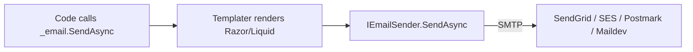

# Topic 9 — File Uploads, Background Jobs & Email

> **Goal**: Add three production-grade capabilities to TaskFlow — multipart file uploads with virus scan + storage abstraction, background processing for thumbnails / digest emails / cleanup, and transactional email via SMTP/SendGrid.

---

## 1. The trio and why they belong together

These three concerns share a pattern: **the HTTP request shouldn't do the work itself**.

- **File uploads** stream bytes into storage; thumbnails, AV scan, and metadata extraction happen later.
- **Background jobs** are how the API offloads anything taking >100 ms: emails, image processing, exports, scheduled cleanup.
- **Email** must be retried, deduped, and audited — exactly what a job system gives you.

The integration story: an upload completes → API enqueues `ScanFileJob` and `MakeThumbnailJob` → on completion, enqueue `SendUploadConfirmationEmail`. The HTTP request returns 201 in milliseconds.

---

## 2. File uploads — the four ways

| Method | When to use | Trade-offs |
|---|---|---|
| `IFormFile` (buffered) | Small files <1 MB, simple forms | Buffers entire file into memory |
| `Request.Form.Files` streaming | Up to ~30 MB | Still RAM-bound by `MultipartBodyLengthLimit` |
| `MultipartReader` streaming | Multi-MB → multi-GB | Manual parsing, async stream copy |
| **Direct-to-storage** (presigned URL) | Multi-GB, untrusted users | API never sees bytes; metadata posted separately |

For TaskFlow MVP: `IFormFile` for avatars (≤2 MB), `MultipartReader` for task attachments (up to 50 MB). Defer presigned URLs until needed.

---

## 3. Streaming with `MultipartReader`

```csharp
[HttpPost("/api/v1/tasks/{taskId:guid}/attachments")]
[RequestSizeLimit(50_000_000)]                              // 50 MB hard cap
[RequestFormLimits(MultipartBodyLengthLimit = 50_000_000)]
public async Task<IActionResult> Upload(Guid taskId, CancellationToken ct)
{
    if (!MediaTypeHeaderValue.TryParse(Request.ContentType, out var ct2)
        || !ct2.MediaType.StartsWith("multipart/", StringComparison.OrdinalIgnoreCase))
        return BadRequest("Expected multipart/form-data");

    var boundary = HeaderUtilities.RemoveQuotes(ct2.Boundary).Value
                   ?? throw new InvalidDataException("Missing boundary");
    var reader = new MultipartReader(boundary, Request.Body);

    while (await reader.ReadNextSectionAsync(ct) is { } section)
    {
        if (!ContentDispositionHeaderValue.TryParse(section.ContentDisposition, out var cd)
            || !cd.FileName.HasValue) continue;

        var safeName = WebUtility.HtmlEncode(Path.GetFileName(cd.FileName.Value));
        var contentType = section.ContentType ?? "application/octet-stream";
        if (!_allowedTypes.Contains(contentType))
            return UnprocessableEntity(new ProblemDetails { Title = "Disallowed file type" });

        await using var stream = section.Body;
        var attachment = await _storage.SaveAsync(taskId, safeName, contentType, stream, ct);
        // P3: enqueue scan + thumbnail jobs here
        return CreatedAtAction(nameof(Get), new { id = attachment.Id }, attachment);
    }
    return BadRequest("No file in request");
}
```

**Key disciplines:**
- ✅ Validate content-type **and** file extension server-side (clients lie).
- ✅ Sanitize filename: never trust `Path.GetFileName` alone — strip path traversal (`..`), null bytes, control chars.
- ✅ Stream straight to disk/blob; never `await stream.ReadToEndAsync()`.
- ✅ Set both `RequestSizeLimit` and `MultipartBodyLengthLimit`.
- ✅ Use `Request.Body` only when `[DisableFormValueModelBinding]` is set on the action.

---

## 4. Storage abstraction

```csharp
public interface IFileStorage
{
    Task<StoredFile> SaveAsync(string folder, string filename, string contentType,
                               Stream content, CancellationToken ct);
    Task<Stream> OpenReadAsync(string key, CancellationToken ct);
    Task DeleteAsync(string key, CancellationToken ct);
    Uri GetReadUrl(string key, TimeSpan ttl);                // presigned for direct browser fetch
}

public sealed record StoredFile(string Key, long Size, string ContentType, string Sha256);
```

Two implementations:
- **`LocalDiskStorage`** — `wwwroot/uploads/{folder}/{guid}_{filename}`. Dev only.
- **`AzureBlobStorage`** — uses `BlobContainerClient`. Production. SAS URL for `GetReadUrl`.

Bind via configuration:
```csharp
if (builder.Configuration.GetValue<string>("Storage:Provider") == "Azure")
    builder.Services.AddSingleton<IFileStorage, AzureBlobStorage>();
else
    builder.Services.AddSingleton<IFileStorage, LocalDiskStorage>();
```

---

## 5. Hashing + deduplication

Compute SHA-256 while streaming so you get the hash for free:

```csharp
public async Task<StoredFile> SaveAsync(...)
{
    using var sha = SHA256.Create();
    await using var fs = File.Create(path);
    await using var crypto = new CryptoStream(fs, sha, CryptoStreamMode.Write);
    await content.CopyToAsync(crypto, ct);
    crypto.FlushFinalBlock();
    var hashHex = Convert.ToHexString(sha.Hash!);
    return new StoredFile(key, fs.Length, contentType, hashHex);
}
```

Store the hash in `Attachment.Sha256` — duplicate uploads can short-circuit (return existing key) and save storage.

---

## 6. Anti-virus + content checks

Don't roll your own. Wire one:
- **ClamAV** via `nClam` package or HTTP gateway.
- **Azure Defender for Storage** auto-scans blobs (out-of-band).
- **Magic-byte sniffing** with `MimeDetective` (rejects `.exe` renamed to `.png`).

```csharp
public sealed class ScanFileJob : IBackgroundJob
{
    public async Task ExecuteAsync(Guid attachmentId, CancellationToken ct)
    {
        var att = await _db.Attachments.FindAsync(attachmentId, ct)
                  ?? throw new InvalidOperationException("Missing");
        await using var stream = await _storage.OpenReadAsync(att.StorageKey, ct);
        var result = await _av.ScanAsync(stream, ct);
        if (result.IsInfected)
        {
            att.Status = AttachmentStatus.Quarantined;
            await _storage.DeleteAsync(att.StorageKey, ct);
            await _notifier.NotifyUser(att.UploadedBy, new("Upload blocked", att.FileName, null));
        }
        else att.Status = AttachmentStatus.Available;
        await _db.SaveChangesAsync(ct);
    }
}
```

---

## 7. Background jobs — the options

| Library | Persistence | Distribution | Best for |
|---|---|---|---|
| `IHostedService` / `BackgroundService` | None — in-process | Single instance | Polling, schedules, in-proc work |
| `Channel<T>` + worker | None | Single instance | Fire-and-forget within a process |
| **Hangfire** | SQL Server / Redis | Multiple instances, dashboard, cron | TaskFlow choice — production-ready, observable |
| Quartz.NET | SQL / RAM | Multiple, flexible scheduling | Cron-heavy schedulers |
| Azure Functions / Service Bus | External | Serverless | Decouple from API host |
| MassTransit + RabbitMQ | External | Multiple, complex routing | Event-driven microservices |

TaskFlow uses **Hangfire** — SQL Server-backed (already provisioned), built-in dashboard, retries/cron, plays nicely with DI.

---

## 8. Hangfire setup

```bash
dotnet add package Hangfire.AspNetCore
dotnet add package Hangfire.SqlServer
```

```csharp
builder.Services.AddHangfire(c => c
    .UseSimpleAssemblyNameTypeSerializer()
    .UseRecommendedSerializerSettings()
    .UseSqlServerStorage(builder.Configuration.GetConnectionString("TaskFlow"),
        new SqlServerStorageOptions
        {
            CommandBatchMaxTimeout = TimeSpan.FromMinutes(5),
            SlidingInvisibilityTimeout = TimeSpan.FromMinutes(5),
            QueuePollInterval = TimeSpan.Zero,
            UseRecommendedIsolationLevel = true,
            DisableGlobalLocks = true,
        }));

builder.Services.AddHangfireServer(o =>
{
    o.WorkerCount = Math.Min(Environment.ProcessorCount * 2, 20);
    o.Queues = ["default", "emails", "scans"];
});

app.UseHangfireDashboard("/hangfire", new DashboardOptions
{
    Authorization = [new HangfireAdminAuthorizationFilter()]      // require admin role
});
```

**Enqueueing:**

```csharp
_jobs.Enqueue<ScanFileJob>(j => j.ExecuteAsync(attachment.Id, CancellationToken.None));
_jobs.Schedule<DigestEmailJob>(j => j.SendAsync(userId, CancellationToken.None), TimeSpan.FromHours(1));
RecurringJob.AddOrUpdate<CleanupJob>("daily-cleanup", j => j.RunAsync(CancellationToken.None), Cron.Daily);
```

> Pass **only primitive ids** to job methods — never EF entities or DbContext. The job runs in a separate scope; it must reload from the database.

---

## 9. Idempotency in jobs

Jobs are retried on failure (exponential backoff, default 10 attempts). Every job must be **idempotent**:

```csharp
public async Task SendWelcomeEmail(Guid userId, CancellationToken ct)
{
    var user = await _db.Users.FindAsync(userId, ct);
    if (user is null || user.WelcomeEmailSentAt is not null) return;     // already done
    await _email.SendAsync(...);
    user.WelcomeEmailSentAt = DateTimeOffset.UtcNow;
    await _db.SaveChangesAsync(ct);
}
```

**The "outbox pattern"** strengthens this: write the intent to send into an `OutboxMessage` table inside the same transaction as the business change; a worker dequeues and dispatches. Guarantees at-least-once with no lost messages — crucial for emails on critical events.

---

## 10. Email — the layers



**Don't bind to a single provider.** Define `IEmailSender`:

```csharp
public interface IEmailSender
{
    Task SendAsync(EmailMessage message, CancellationToken ct);
}
public sealed record EmailMessage(string To, string Subject, string Html, string? Text = null,
                                  IReadOnlyList<EmailAttachment>? Attachments = null);
```

Implementations:
- **`SmtpEmailSender`** using `MailKit.Net.Smtp.SmtpClient` (`MailKit` package). Works with Maildev/Mailpit in dev.
- **`SendGridEmailSender`** using `SendGrid` SDK in production.

Templating with **Razor** via `RazorLight` or **Scriban** for sandboxing. Templates live in `Application/Emails/Templates/*.razor` with strongly-typed models.

---

## 11. Local dev — Mailpit / Maildev

```yaml
# docker-compose.yml
services:
  mailpit:
    image: axllent/mailpit
    ports:
      - "1025:1025"   # SMTP
      - "8025:8025"   # Web UI
```

Configure SMTP host=`localhost:1025`, no auth. View every sent email at `http://localhost:8025` — no production data leaks, no real inboxes during testing.

---

## 12. Sample email job

```csharp
public sealed class SendWelcomeEmailJob
{
    private readonly TaskFlowDbContext _db;
    private readonly IEmailSender _email;
    private readonly IRazorViewRenderer _renderer;

    public async Task ExecuteAsync(Guid userId, CancellationToken ct)
    {
        var user = await _db.Users.AsNoTracking().FirstAsync(u => u.Id == userId, ct);
        var html = await _renderer.RenderAsync("Emails/Welcome", new WelcomeModel(user.DisplayName));
        await _email.SendAsync(new EmailMessage(user.Email, "Welcome to TaskFlow", html), ct);
    }
}
```

Enqueue from the registration command handler:

```csharp
await _db.SaveChangesAsync(ct);
_jobs.Enqueue<SendWelcomeEmailJob>(j => j.ExecuteAsync(user.Id, CancellationToken.None));
```

---

## 13. Outbox pattern (at-least-once messaging)

Tables:

```sql
CREATE TABLE OutboxMessages (
    Id          UNIQUEIDENTIFIER PRIMARY KEY,
    OccurredAt  DATETIME2(3)     NOT NULL,
    Type        NVARCHAR(200)    NOT NULL,
    Payload     NVARCHAR(MAX)    NOT NULL,
    ProcessedAt DATETIME2(3)     NULL,
    Error       NVARCHAR(MAX)    NULL
);
```

Flow:
1. Business change + `OutboxMessages` insert in **one transaction**.
2. `OutboxRelayJob` (recurring every 5 s) reads unprocessed rows and dispatches.
3. Marks `ProcessedAt` after success; logs `Error` on failure.

**Why?** Pure `Enqueue()` from inside a transaction risks two bad outcomes: (a) commit succeeds, enqueue fails → lost email; (b) enqueue succeeds, commit fails → orphan email about a non-existent thing. Outbox makes (a) and (b) both impossible.

---

## 14. Cron / recurring jobs

```csharp
RecurringJob.AddOrUpdate<DigestEmailJob>(
    "daily-digest", j => j.SendAllAsync(CancellationToken.None), Cron.Daily(8));   // 08:00 UTC

RecurringJob.AddOrUpdate<CleanupJob>(
    "purge-deleted-tasks", j => j.PurgeAsync(CancellationToken.None), Cron.Hourly);
```

Use Cron.NET expressions; verify with `https://crontab.guru`.

---

## 15. Failures, retries, dead-lettering

Hangfire defaults:
- 10 retries with exponential backoff.
- After 10 failures, job moves to **Failed** state — visible in dashboard, requires human action.
- Add `[AutomaticRetry(Attempts = 3, OnAttemptsExceeded = AttemptsExceededAction.Delete)]` for jobs that shouldn't pile up indefinitely.

Always log the **correlation id** that triggered the job so you can trace from API request → job execution.

---

## 16. Testing

- **Unit-test job classes** by mocking `IEmailSender`, `IFileStorage`, etc. — they're plain DI services.
- **Integration-test the upload endpoint** with `WebApplicationFactory` + `MultipartFormDataContent`. Topic 10 covers this.
- **Mailpit in CI** — same SMTP image, assert via Mailpit's HTTP API that the right email landed.
- **Hangfire in tests** — use the `BackgroundJobClientMock` from `Hangfire.Core`, or run an in-memory storage variant.

---

## 17. Security + compliance checklist

- ✅ Reject filenames with `..`, null bytes, or absolute paths.
- ✅ Validate by **magic bytes**, not just `Content-Type`.
- ✅ Cap request size (`RequestSizeLimit`) at every layer.
- ✅ Store uploads outside the web-served directory (or use blob with private container + presigned URLs).
- ✅ Set `Content-Disposition: attachment` on download to prevent inline HTML execution.
- ✅ Strip EXIF/metadata from images (`SixLabors.ImageSharp`).
- ✅ AV scan before allowing other users to download.
- ✅ Rate-limit upload endpoints per user.
- ✅ Hangfire dashboard MUST require admin authorization — exposes job payloads.
- ✅ Never put PII in job arguments — pass IDs and re-fetch.
- ✅ Use TLS to SMTP (port 587 + STARTTLS) — never plain 25.
- ✅ DKIM/SPF/DMARC for sender domains.

---

## 18. Common pitfalls

| Pitfall | Fix |
|---|---|
| `Multipart body length limit 134217728 exceeded` | Increase via `[RequestFormLimits]` and `[RequestSizeLimit]`. |
| File saved with traversal (`../etc/passwd`) | Sanitize filename + use a generated key, not the user's path. |
| `IFormFile` OOM on big uploads | Switch to `MultipartReader` streaming. |
| `DbContext` captured in a Hangfire job | Pass IDs only; resolve scoped services via DI inside the job. |
| Emails sent twice on retry | Idempotency check or outbox pattern. |
| Job fails silently in dev | Open `/hangfire` dashboard — check Failed tab. |
| `Cron.Daily()` runs at 00:00 UTC unexpectedly | Pass hour explicitly: `Cron.Daily(8)`. |
| Outbox table grows forever | Add a recurring job to delete `ProcessedAt < UtcNow.AddDays(-30)`. |

---

## 19. 10 Q&A

1. **Why stream uploads instead of using `IFormFile`?** `IFormFile` buffers the entire request body in memory; large uploads from many users can OOM the server. Streaming with `MultipartReader` keeps memory bounded.
2. **Why a storage abstraction over direct `BlobClient` calls?** Local-disk dev parity, swappable providers (Azure ↔ S3), and easier unit tests against an in-memory implementation.
3. **Why deduplicate uploads via SHA-256?** Two users uploading the identical 10 MB file → one blob, two `Attachment` rows pointing at the same key. Saves cost and bandwidth.
4. **Why is direct-to-storage with presigned URLs better for huge files?** API never sees the bytes, scaling concern shifts to blob storage which is built for it. The API only validates metadata + records the upload.
5. **What does Hangfire give over `BackgroundService`?** Persistence (jobs survive restarts), distribution (multiple workers), retries with backoff, scheduling/cron, and a dashboard.
6. **Why pass only IDs into job methods?** Job arguments are serialized to storage. Entities won't survive serialization, DbContexts are scoped, and embedding rich objects bloats the storage.
7. **What does the outbox pattern guarantee?** Atomic *commit + intent-to-send* in one transaction → the message is dispatched at-least-once with no loss and no orphans.
8. **Why is every job idempotent?** Hangfire (and any retry-based system) will sometimes execute the same job twice. Idempotency makes that safe.
9. **Why ClamAV / AV scanning before serving downloads?** Uploads from one user reach other users — without scanning you'd be a malware delivery service.
10. **Why is the Hangfire dashboard a security concern?** It shows job payloads — including any IDs/emails/data passed as arguments. Lock it behind admin auth in every environment.
