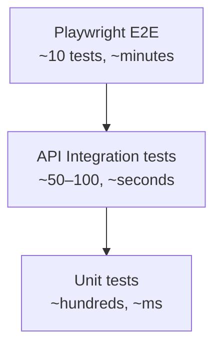

# Topic 10 — Testing the Full Stack

> **Goal**: Cover TaskFlow with the full test pyramid — unit tests, API integration tests with `WebApplicationFactory` + Testcontainers, frontend component tests with Vitest + RTL + MSW, and end-to-end smoke tests with Playwright.

---

## 1. The pyramid (and where to spend the budget)



| Layer | What it tests | Typical count | Speed | Cost when broken |
|---|---|---|---|---|
| Unit | Pure logic, validators, mappers, handlers | 200–1000 | ms each | Cheapest to fix |
| API integration | Controllers + EF + auth, with real DB via Testcontainers | 50–100 | 100 ms–2 s each | Worth it for HTTP contract |
| Component | React components in jsdom + MSW | 50–200 | tens of ms | Catches UI logic regressions |
| E2E | Whole app in a real browser | 10–30 | seconds–minutes | Most expensive, least flake-tolerant |

**Rule:** Push test cases as low in the pyramid as you can. An assertion that lives in a unit test runs 1000× faster than the same assertion in Playwright.

---

## 2. .NET test stack

```bash
dotnet new xunit -n TaskFlow.UnitTests
dotnet add package FluentAssertions
dotnet add package NSubstitute
dotnet add package Microsoft.AspNetCore.Mvc.Testing
dotnet add package Testcontainers.MsSql
dotnet add package Bogus               # data fakers
dotnet add package coverlet.collector
```

| Library | Purpose |
|---|---|
| **xUnit** | Test framework |
| **FluentAssertions** | `actual.Should().Be(expected)` — readable failure messages |
| **NSubstitute** | Lightweight mocking (`Substitute.For<IFoo>()`) |
| **Microsoft.AspNetCore.Mvc.Testing** | `WebApplicationFactory<TProgram>` for in-process API hosting |
| **Testcontainers.MsSql** | Real SQL Server in Docker per test class |
| **Bogus** | Realistic faker data — `new Faker<User>()` |
| **coverlet** | Code coverage |

**xUnit fixture lifetime:**
- `IClassFixture<T>` — once per test class (cheap setup, parallel-safe across classes).
- `ICollectionFixture<T>` — across multiple classes that opt-in (use for the SQL container — one per test run).

---

## 3. Unit tests — handlers, validators, mappers

```csharp
public sealed class CreateProjectHandlerTests
{
    [Fact]
    public async Task Returns_validation_error_when_name_is_blank()
    {
        var db = InMemoryDbFactory.Create();
        var handler = new CreateProjectHandler(db, new FakeCurrentUser());

        var act = () => handler.Handle(new CreateProjectCommand(""), default);

        await act.Should().ThrowAsync<ValidationException>()
                 .Where(e => e.Errors.Any(x => x.PropertyName == "Name"));
    }
}
```

**`InMemoryDbFactory`** uses EF's SQLite in-memory provider — closer to real SQL semantics than `UseInMemoryDatabase` (which doesn't enforce constraints):

```csharp
public static TaskFlowDbContext Create()
{
    var conn = new SqliteConnection("Filename=:memory:");
    conn.Open();
    var opts = new DbContextOptionsBuilder<TaskFlowDbContext>()
        .UseSqlite(conn)
        .Options;
    var db = new TaskFlowDbContext(opts);
    db.Database.EnsureCreated();
    return db;
}
```

> **`UseInMemoryDatabase` is banned** in TaskFlow tests — it lets bugs through (no FK enforcement, no concurrency, different LINQ translation).

---

## 4. Validator tests

```csharp
public sealed class CreateProjectValidatorTests
{
    private readonly CreateProjectValidator _v = new();

    [Theory]
    [InlineData("", "Name is required")]
    [InlineData("a", "must be at least 3")]
    [InlineData("aaaaaaaaaaaaaaaaaaaaaaaaaaaaaaaaaaaaaaaaaaaaaaaaaaaa", "must be at most 50")]
    public void Rejects_invalid_names(string name, string contains)
    {
        var result = _v.Validate(new CreateProjectCommand(name));
        result.IsValid.Should().BeFalse();
        result.Errors.Should().Contain(e => e.ErrorMessage.Contains(contains));
    }
}
```

---

## 5. API integration tests with `WebApplicationFactory`

```csharp
public sealed class TaskFlowApiFactory : WebApplicationFactory<Program>, IAsyncLifetime
{
    private readonly MsSqlContainer _sql = new MsSqlBuilder()
        .WithImage("mcr.microsoft.com/mssql/server:2022-latest")
        .WithPassword("Test_Pass_123!")
        .Build();

    public string ConnectionString => _sql.GetConnectionString();

    public Task InitializeAsync() => _sql.StartAsync();
    public new Task DisposeAsync() => _sql.DisposeAsync().AsTask();

    protected override void ConfigureWebHost(IWebHostBuilder builder)
    {
        builder.UseEnvironment("Testing");
        builder.ConfigureAppConfiguration((_, cfg) =>
        {
            cfg.AddInMemoryCollection(new Dictionary<string, string?>
            {
                ["ConnectionStrings:TaskFlow"] = ConnectionString,
                ["Jwt:SigningKey"] = "test-only-key-32-chars-minimum-1234",
            });
        });
        builder.ConfigureTestServices(services =>
        {
            // Replace external services with fakes.
            services.RemoveAll<IEmailSender>();
            services.AddSingleton<IEmailSender, FakeEmailSender>();
        });
    }
}
```

**Collection fixture** (one container shared across tests):

```csharp
[CollectionDefinition("api")]
public sealed class ApiCollection : ICollectionFixture<TaskFlowApiFactory> { }

[Collection("api")]
public sealed class ProjectsEndpointTests
{
    private readonly TaskFlowApiFactory _factory;
    public ProjectsEndpointTests(TaskFlowApiFactory f) => _factory = f;

    [Fact]
    public async Task POST_returns_201_with_location_header()
    {
        await using var scope = _factory.Services.CreateAsyncScope();
        var db = scope.ServiceProvider.GetRequiredService<TaskFlowDbContext>();
        await db.Database.MigrateAsync();
        await SeedUserAsync(db, email: "alice@x.com");

        var client = _factory.CreateClient();
        client.DefaultRequestHeaders.Authorization = await AuthHelpers.BearerAsync(client, "alice@x.com");

        var res = await client.PostAsJsonAsync("/api/v1/projects", new { name = "P1" });

        res.StatusCode.Should().Be(HttpStatusCode.Created);
        res.Headers.Location.Should().NotBeNull();
        var body = await res.Content.ReadFromJsonAsync<ProjectDto>();
        body!.Name.Should().Be("P1");
    }
}
```

**Why a real SQL container?** EF query translation differs by provider — your `OrderBy(...).Skip().Take()` against SQLite might happen to work but blow up against SQL Server. Test where you ship.

---

## 6. Per-test isolation strategies

| Strategy | Speed | Isolation | When |
|---|---|---|---|
| `Respawn` to wipe tables between tests | Fast | Strong | Default |
| New schema per class | Slower | Stronger | Heavy schema churn |
| Transaction-rollback per test | Very fast | Limited (won't catch SAVE TRAN bugs) | Read-only suites |
| Container per test | Very slow | Total | Avoid |

```csharp
private readonly Respawner _respawner;

public async Task ResetAsync()
{
    await using var conn = new SqlConnection(_factory.ConnectionString);
    await conn.OpenAsync();
    await _respawner.ResetAsync(conn);
}
```

`IAsyncLifetime` on a base test class lets you call `ResetAsync()` in `InitializeAsync` — guaranteed clean DB before every fact.

---

## 7. Authentication helpers

Real JWT issuance keeps the auth pipeline honest:

```csharp
public static class AuthHelpers
{
    public static async Task<AuthenticationHeaderValue> BearerAsync(HttpClient c, string email)
    {
        var login = await c.PostAsJsonAsync("/api/v1/auth/login",
            new { email, password = "Test_Pass_123!" });
        var body = await login.Content.ReadFromJsonAsync<LoginResponse>();
        return new AuthenticationHeaderValue("Bearer", body!.AccessToken);
    }
}
```

For tests where you don't care to exercise login, mint a JWT directly using the same signing key.

---

## 8. Testing SignalR hubs

```csharp
[Fact]
public async Task Hub_pushes_TaskUpdated_to_project_group()
{
    var client = _factory.CreateClient();
    var token = await AuthHelpers.GetTokenAsync(client, "alice@x.com");

    var server = _factory.Server;
    var hub = new HubConnectionBuilder()
        .WithUrl(server.BaseAddress + "hubs/taskflow", o =>
        {
            o.HttpMessageHandlerFactory = _ => server.CreateHandler();
            o.AccessTokenProvider = () => Task.FromResult<string?>(token);
        })
        .Build();

    var received = new TaskCompletionSource<TaskDetailDto>();
    hub.On<TaskDetailDto>("TaskUpdated", t => received.TrySetResult(t));

    await hub.StartAsync();
    await hub.InvokeAsync("JoinProject", projectId);

    await client.PatchAsJsonAsync($"/api/v1/tasks/{taskId}", new { status = "Done" });

    var pushed = await received.Task.WaitAsync(TimeSpan.FromSeconds(5));
    pushed.Status.Should().Be("Done");
}
```

`server.CreateHandler()` is the magic — it routes the SignalR client through the in-process `TestServer` without binding to a real port.

---

## 9. Testing background jobs

Hangfire jobs are plain DI services. Don't go through Hangfire to test them:

```csharp
[Fact]
public async Task Welcome_job_is_idempotent()
{
    var email = Substitute.For<IEmailSender>();
    var job = new SendWelcomeEmailJob(_db, email, _templates);

    await job.ExecuteAsync(_user.Id, default);
    await job.ExecuteAsync(_user.Id, default);

    await email.Received(1).SendAsync(Arg.Any<EmailMessage>(), Arg.Any<CancellationToken>());
}
```

For end-to-end *enqueue → execute*, run a real Hangfire server in-process with `MemoryStorage` and assert via `JobStorage.Current.GetMonitoringApi().SucceededList(...)`.

---

## 10. Frontend — Vitest + React Testing Library + MSW

```bash
npm i -D vitest @testing-library/react @testing-library/user-event @testing-library/jest-dom jsdom msw
```

`vitest.config.ts` already wires `jsdom` + setup file (Topic 7 scaffold).

`src/test/setup.ts`:

```ts
import '@testing-library/jest-dom/vitest';
import { afterAll, afterEach, beforeAll } from 'vitest';
import { server } from '@mocks/server';

beforeAll(() => server.listen({ onUnhandledRequest: 'error' }));
afterEach(() => server.resetHandlers());
afterAll(() => server.close());
```

> **`onUnhandledRequest: 'error'`** is the single most useful setting — fails the test on any request you forgot to mock.

A component test:

```tsx
import { render, screen } from '@testing-library/react';
import userEvent from '@testing-library/user-event';
import { QueryClient, QueryClientProvider } from '@tanstack/react-query';
import { LoginPage } from '@features/auth/LoginPage';

function renderWithProviders(ui: React.ReactNode) {
  const qc = new QueryClient({ defaultOptions: { queries: { retry: false } } });
  return render(<QueryClientProvider client={qc}>{ui}</QueryClientProvider>);
}

test('shows error on invalid credentials', async () => {
  renderWithProviders(<LoginPage />);
  await userEvent.type(screen.getByLabelText(/email/i), 'wrong@x.com');
  await userEvent.type(screen.getByLabelText(/password/i), 'badpass1');
  await userEvent.click(screen.getByRole('button', { name: /sign in/i }));

  expect(await screen.findByRole('alert')).toHaveTextContent(/invalid credentials/i);
});
```

**Discipline:**
- ✅ Query by **role + name** — what assistive tech sees, not implementation.
- ✅ Use `userEvent`, never `fireEvent` (closer to real input).
- ✅ Disable retries in the test `QueryClient` — otherwise tests wait minutes.
- ✅ Wrap async assertions in `findBy*` (built-in waitFor) — not manual `setTimeout`.
- ❌ Don't test internal state; test rendered output.

---

## 11. Hooks tests with `renderHook`

```ts
import { renderHook, waitFor } from '@testing-library/react';
import { QueryClient, QueryClientProvider } from '@tanstack/react-query';
import { useProjects } from '@features/projects/api';

test('useProjects returns the page from the API', async () => {
  const qc = new QueryClient({ defaultOptions: { queries: { retry: false } } });
  const wrapper = ({ children }: any) => (
    <QueryClientProvider client={qc}>{children}</QueryClientProvider>
  );

  const { result } = renderHook(() => useProjects(), { wrapper });
  await waitFor(() => expect(result.current.isSuccess).toBe(true));
  expect(result.current.data!.items).toHaveLength(2);
});
```

---

## 12. E2E with Playwright

```bash
npm init playwright@latest
```

`playwright.config.ts` essentials:

```ts
export default defineConfig({
  testDir: './e2e',
  fullyParallel: true,
  retries: process.env.CI ? 2 : 0,
  use: { baseURL: 'http://localhost:5173', trace: 'retain-on-failure', video: 'retain-on-failure' },
  projects: [
    { name: 'chromium', use: { ...devices['Desktop Chrome'] } },
    { name: 'firefox',  use: { ...devices['Desktop Firefox'] } },
  ],
  webServer: [
    { command: 'dotnet run --project ../Api', url: 'https://localhost:7104/health/live', reuseExistingServer: !process.env.CI },
    { command: 'npm run dev',                  url: 'http://localhost:5173',              reuseExistingServer: !process.env.CI },
  ],
});
```

Sample test:

```ts
test('user can create a project', async ({ page }) => {
  await page.goto('/login');
  await page.getByLabel('Email').fill('demo@taskflow.dev');
  await page.getByLabel('Password').fill('password123');
  await page.getByRole('button', { name: 'Sign in' }).click();

  await page.getByRole('button', { name: 'New project' }).click();
  await page.getByLabel('Name').fill('Marketing site');
  await page.getByRole('button', { name: 'Create' }).click();

  await expect(page.getByRole('heading', { name: 'Marketing site' })).toBeVisible();
});
```

**Disciplines for non-flaky E2E:**
- ✅ **No `setTimeout`** — use `expect(...).toBeVisible()` (auto-waiting).
- ✅ Locators by role/label, not CSS selectors that change.
- ✅ Seed data via API, not via UI clicks (faster + deterministic).
- ✅ One independent storage state per worker; reset DB between specs (admin seed endpoint).
- ✅ Trace on failure is invaluable; the trace viewer beats every console log.
- ❌ Don't share login flows across tests via cookies you store manually — use `storageState`.

```ts
// auth.setup.ts (run once, share storageState across tests)
test('authenticate', async ({ page }) => {
  await page.goto('/login');
  await page.getByLabel('Email').fill('demo@taskflow.dev');
  await page.getByLabel('Password').fill('password123');
  await page.getByRole('button', { name: 'Sign in' }).click();
  await page.context().storageState({ path: 'e2e/.auth/user.json' });
});
```

```ts
// playwright.config.ts
projects: [
  { name: 'setup', testMatch: /.*\.setup\.ts/ },
  { name: 'chromium',
    dependencies: ['setup'],
    use: { ...devices['Desktop Chrome'], storageState: 'e2e/.auth/user.json' } },
]
```

---

## 13. Visual regression (optional)

`@playwright/test` ships `expect(page).toHaveScreenshot()` — image diff with baseline. Use sparingly:
- ✅ For the design system primitives page (catches accidental token changes).
- ❌ For data-heavy pages (false positives explode).

---

## 14. Coverage targets (TaskFlow)

| Area | Target | Reasoning |
|---|---|---|
| `Application` (handlers, validators) | 90%+ | Pure logic, cheap |
| `Domain` | 95%+ | Invariants must hold |
| `Infrastructure` (EF, integrations) | 60% | Tested at integration layer |
| `Api` controllers | 70% via integration | Logic should be in handlers |
| Frontend `features/` hooks | 80% | High value |
| Frontend pages | 50% | Often glue, covered by E2E |

**Don't chase 100%** — diminishing returns. Lock in critical paths and let coverage be a side effect.

---

## 15. CI matrix

| Stage | Tool | Time budget |
|---|---|---|
| `dotnet build` + warnings as errors | dotnet | 30 s |
| `dotnet test --filter Category!=Integration` | xUnit | 30 s |
| Spin up SQL container; run integration tests | xUnit + Testcontainers | 1–3 min |
| `npm run typecheck && lint && test` | Vitest | 30 s |
| Build frontend; serve dist; run Playwright | Playwright | 2–5 min |

Topic 12 wires this into GitHub Actions.

---

## 16. Common pitfalls

| Pitfall | Fix |
|---|---|
| `WebApplicationFactory` can't find `Program` | Add `public partial class Program { }` at end of `Program.cs`. |
| Tests pass locally, fail in CI | Use Testcontainers (same DB everywhere); pin image tag. |
| Flaky time-dependent tests | Inject `IClock`; never call `DateTime.UtcNow` directly. |
| RTL "act() warnings" | Use `findBy*` instead of `getBy*` after async actions. |
| MSW returns "request not handled" | Add the handler or set `onUnhandledRequest: 'error'` to find which. |
| Playwright "selector not found" | Use `getByRole`/`getByLabel`; add `.toBeVisible()` to wait. |
| Slow integration tests | Reuse the container across the whole run via collection fixture. |
| Auth cookie flake in Playwright | Use `storageState` from setup project; don't log in per test. |

---

## 17. 10 Q&A

1. **Why prefer SQLite-in-memory over `UseInMemoryDatabase` for unit tests?** SQLite enforces FKs and runs real SQL — much closer to production behavior; the in-memory provider lets bugs through.
2. **When are Testcontainers worth it?** Whenever EF translation, indexes, or DB-specific features matter. The 2 s startup cost amortizes over a whole test run.
3. **Why share the SQL container across tests via collection fixture?** Container startup is the slow part. Per-test resets via Respawn give isolation cheaply.
4. **What does `WebApplicationFactory<Program>` give you?** Boots the API in-process, returns an `HttpClient` and a `Server`, exposes DI for substitution. No real port, no firewall, full middleware pipeline.
5. **Why does `Program` need `public partial class Program {}`?** Top-level statements compile `Program` as `internal`; the factory needs it `public` to instantiate.
6. **How do you keep tests deterministic for time?** Inject an `IClock` (`Now()`/`UtcNow()`); use a `FakeClock` in tests. Never call static `DateTime` APIs from production code.
7. **Why prefer `userEvent` over `fireEvent`?** `userEvent` simulates real input semantics (focus, key sequences, blur). `fireEvent` skips them and lets bugs through.
8. **Why disable query retries in the test `QueryClient`?** Default retry-with-backoff makes tests wait many seconds for failure paths. Disable to fail fast.
9. **What's the trade-off of E2E vs integration tests?** E2E exercises everything end-to-end (highest fidelity) but is slow and flaky; integration covers HTTP+DB+auth in seconds. Use E2E sparingly for critical user journeys.
10. **Why is `onUnhandledRequest: 'error'` important in MSW?** It surfaces every request the test forgot to mock. Without it, real network calls leak from the test environment.
