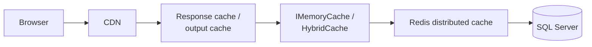

# Topic 11 — Logging, Observability, Caching & Performance

> **Goal**: Make TaskFlow operable in production — structured logs, distributed traces, metrics, health checks, Redis caching, response compression, EF tuning, and a performance budget that fails CI when violated.

---

## 1. The three pillars (and one extra)

| Pillar | Question it answers | Tool |
|---|---|---|
| **Logs** | "What happened?" | Serilog → Seq / Loki / App Insights |
| **Metrics** | "How often / how slow?" | OpenTelemetry → Prometheus / App Insights |
| **Traces** | "Where did the request go?" | OpenTelemetry → Jaeger / Zipkin / App Insights |
| **Profiles** (extra) | "Why is this slow?" | dotnet-trace, dotnet-counters, BenchmarkDotNet |

Logs answer questions about specific events; metrics aggregate them; traces show causality. Each has its own retention/cardinality cost — over-tagging metrics is the #1 way to torch your observability bill.

---

## 2. Structured logging with Serilog

```csharp
// Program.cs — bootstrap logger BEFORE the host so startup errors are captured.
Log.Logger = new LoggerConfiguration()
    .WriteTo.Console(new RenderedCompactJsonFormatter())
    .CreateBootstrapLogger();

var builder = WebApplication.CreateBuilder(args);

builder.Host.UseSerilog((ctx, services, cfg) => cfg
    .ReadFrom.Configuration(ctx.Configuration)
    .ReadFrom.Services(services)
    .Enrich.FromLogContext()
    .Enrich.WithMachineName()
    .Enrich.WithProperty("App", "TaskFlow.Api")
    .Enrich.WithProperty("Env", ctx.HostingEnvironment.EnvironmentName)
    .WriteTo.Console(new RenderedCompactJsonFormatter())
    .WriteTo.Seq(ctx.Configuration["Seq:Url"] ?? "http://localhost:5341"));
```

**Key disciplines:**
- ✅ Use **structured templates**: `_log.LogInformation("Project {ProjectId} created by {UserId}", id, userId)` — never `$"Project {id}..."`. Structured fields are queryable; interpolation just turns into a string.
- ✅ Enrich with `RequestId`, `TraceId`, `UserId` from middleware so every log line is correlated.
- ❌ Never log secrets/PII. Add a destructuring policy that drops fields named `Password`, `Token`, `Cookie`.

```csharp
.Destructure.ByTransforming<LoginRequest>(r => new { r.Email })   // strip Password
```

---

## 3. Correlation across services

A correlation id should flow from frontend → API → background job → email service so you can stitch logs end-to-end.

```csharp
app.Use(async (ctx, next) =>
{
    var correlationId = ctx.Request.Headers["X-Correlation-Id"].FirstOrDefault()
                       ?? Activity.Current?.TraceId.ToString()
                       ?? Guid.NewGuid().ToString("N");
    ctx.Response.Headers["X-Correlation-Id"] = correlationId;
    using (LogContext.PushProperty("CorrelationId", correlationId))
        await next();
});
```

Topic 6/7 already injects `X-Correlation-Id` from the React client. Hangfire jobs (Topic 9) should accept the id as a job arg and re-push it into `LogContext`.

---

## 4. Request logging — focused, not chatty

Default ASP.NET Core request logs are verbose. Replace with Serilog's `UseSerilogRequestLogging`, configured to skip noisy paths and enrich with the user:

```csharp
app.UseSerilogRequestLogging(opts =>
{
    opts.GetLevel = (http, elapsed, ex) =>
        ex is not null ? LogEventLevel.Error :
        http.Response.StatusCode > 499 ? LogEventLevel.Error :
        elapsed > 1500 ? LogEventLevel.Warning :
        LogEventLevel.Information;

    opts.EnrichDiagnosticContext = (diag, http) =>
    {
        diag.Set("UserId", http.User?.FindFirst(JwtRegisteredClaimNames.Sub)?.Value);
        diag.Set("ClientIp", http.Connection.RemoteIpAddress?.ToString());
    };
});
```

Skip `/health/*` and `/swagger` from request logging via configuration filter.

---

## 5. OpenTelemetry — traces + metrics in one wire

```bash
dotnet add package OpenTelemetry.Extensions.Hosting
dotnet add package OpenTelemetry.Exporter.OpenTelemetryProtocol
dotnet add package OpenTelemetry.Instrumentation.AspNetCore
dotnet add package OpenTelemetry.Instrumentation.Http
dotnet add package OpenTelemetry.Instrumentation.EntityFrameworkCore
dotnet add package OpenTelemetry.Instrumentation.StackExchangeRedis
```

```csharp
builder.Services.AddOpenTelemetry()
    .ConfigureResource(r => r.AddService("taskflow-api", serviceVersion: "1.0.0"))
    .WithTracing(t => t
        .AddAspNetCoreInstrumentation(o => o.Filter = ctx => !ctx.Request.Path.StartsWithSegments("/health"))
        .AddHttpClientInstrumentation()
        .AddEntityFrameworkCoreInstrumentation(o => o.SetDbStatementForText = builder.Environment.IsDevelopment())
        .AddSource("TaskFlow.*")
        .AddOtlpExporter())
    .WithMetrics(m => m
        .AddAspNetCoreInstrumentation()
        .AddHttpClientInstrumentation()
        .AddRuntimeInstrumentation()
        .AddProcessInstrumentation()
        .AddMeter("TaskFlow.*")
        .AddOtlpExporter());
```

Add custom traces around interesting operations:

```csharp
private static readonly ActivitySource _activity = new("TaskFlow.Application");

using var span = _activity.StartActivity("CreateProject");
span?.SetTag("user.id", userId);
span?.SetTag("project.name", cmd.Name);
// ... work ...
```

Custom metrics (counters, histograms):

```csharp
private static readonly Meter _meter = new("TaskFlow.Application");
private static readonly Counter<long> _projectsCreated = _meter.CreateCounter<long>("projects.created");
private static readonly Histogram<double> _saveDurationMs = _meter.CreateHistogram<double>("save.duration", "ms");
```

> **Don't tag metrics with high-cardinality values** like user id, request id, or url path. Use `route.template` (`/api/v1/projects/{id}`), not the literal URL.

---

## 6. Application Insights (Azure path)

If you ship to Azure, use App Insights as the OTLP backend:

```csharp
builder.Services.AddApplicationInsightsTelemetry();
builder.Services.AddSerilog((sp, cfg) => cfg
    .WriteTo.ApplicationInsights(sp.GetRequiredService<TelemetryConfiguration>(),
                                 TelemetryConverter.Traces));
```

App Insights honors `Activity.Current` and stitches your logs into the same operation. The Live Metrics blade is the fastest way to confirm it's working.

---

## 7. Health checks — `live`, `ready`, `startup`

Recap from Topic 3, with production hardening:

```csharp
builder.Services.AddHealthChecks()
    .AddSqlServer(connectionString, name: "sqlserver", tags: ["ready"])
    .AddRedis(redisConnection, name: "redis", tags: ["ready"])
    .AddCheck<MigrationsAppliedHealthCheck>("migrations", tags: ["startup"])
    .AddCheck("self", () => HealthCheckResult.Healthy(), tags: ["live"]);

app.MapHealthChecks("/health/live",    new() { Predicate = c => c.Tags.Contains("live") });
app.MapHealthChecks("/health/ready",   new() { Predicate = c => c.Tags.Contains("ready") });
app.MapHealthChecks("/health/startup", new() { Predicate = c => c.Tags.Contains("startup") });
```

| Endpoint | Used by | Failure means |
|---|---|---|
| `/health/live` | Kubernetes `livenessProbe` | Restart the pod |
| `/health/ready` | Kubernetes `readinessProbe` | Stop sending traffic |
| `/health/startup` | Kubernetes `startupProbe` | Wait longer; don't restart |

> Liveness must NOT depend on the database. A DB blip should not restart every API pod simultaneously.

---

## 8. Caching layers



Pick the lowest layer that gives you a hit. Each step up costs more.

| Layer | Tool | Best for |
|---|---|---|
| HTTP response cache | `[ResponseCache]`, `OutputCache` middleware | Public, anonymous, idempotent GETs |
| Process memory | `IMemoryCache` | Per-pod hot data — small, no cross-pod consistency |
| **Distributed (Redis)** | `IDistributedCache`, `StackExchange.Redis` | Cross-pod, shared, sub-ms latency |
| Hybrid | `Microsoft.Extensions.Caching.Hybrid` (.NET 9+) | Both above with one API + stampede protection |

---

## 9. Output caching for public endpoints

```csharp
builder.Services.AddOutputCache(o =>
{
    o.AddBasePolicy(b => b.Expire(TimeSpan.FromSeconds(30)));
    o.AddPolicy("ProjectStats", b => b
        .Expire(TimeSpan.FromMinutes(5))
        .SetVaryByQuery("from", "to")
        .Tag("stats"));
});
app.UseOutputCache();

app.MapGet("/api/v1/stats", ...).CacheOutput("ProjectStats");

// Invalidation when underlying data changes:
await outputCacheStore.EvictByTagAsync("stats", default);
```

---

## 10. Distributed cache with HybridCache

```csharp
builder.Services.AddStackExchangeRedisCache(o => o.Configuration = redisConn);
builder.Services.AddHybridCache(o =>
{
    o.DefaultEntryOptions = new() { LocalCacheExpiration = TimeSpan.FromMinutes(2),
                                    Expiration = TimeSpan.FromMinutes(15) };
});

public sealed class ProjectStatsService(HybridCache cache, TaskFlowDbContext db)
{
    public Task<ProjectStats> GetAsync(Guid projectId, CancellationToken ct) =>
        cache.GetOrCreateAsync(
            $"project:{projectId}:stats",
            async ct =>
            {
                var counts = await db.Tasks.Where(t => t.ProjectId == projectId)
                    .GroupBy(t => t.Status)
                    .Select(g => new { Status = g.Key, Count = g.Count() })
                    .ToListAsync(ct);
                return new ProjectStats(counts.ToDictionary(x => x.Status, x => x.Count));
            },
            tags: ["project-stats", $"project:{projectId}"],
            cancellationToken: ct);
}
```

`HybridCache` solves three things at once:
1. **Two-tier**: hot data in process, warm data in Redis.
2. **Stampede protection**: only one caller fills a missing key; the rest await the same task.
3. **Tag-based invalidation**: `cache.RemoveByTagAsync($"project:{id}")` evicts all derived entries.

---

## 11. Cache invalidation patterns

| Pattern | When | Trade-off |
|---|---|---|
| Time-based (TTL) | Read-heavy, eventual consistency OK | Stale data window |
| Write-through | After every write, refresh cache | Extra cost per write |
| Write-behind | Cache first, persist later | Risk of loss on crash |
| Tag invalidation | Many derived keys per entity | Requires HybridCache or custom registry |
| Event-driven (SignalR / message bus) | Multi-service environments | Most complex |

TaskFlow rule: TTL for everything; supplement with tag invalidation on writes for project stats / dashboards.

---

## 12. EF Core performance toolkit

| Tool | Effect |
|---|---|
| `AsNoTracking()` | Skip change tracking on read-only queries (~30% speedup) |
| `AsSplitQuery()` | Avoid Cartesian explosion on multiple `Include`s |
| `Select(...)` projection | Pull only the columns you render |
| `Where(...)` before `Include(...)` | Avoid loading then filtering in memory |
| `IQueryable.AsAsyncEnumerable()` | Stream results for large exports |
| `EF.CompileAsyncQuery` | One-time tree compile for hot queries |
| `DbContextOptionsBuilder.EnableSensitiveDataLogging()` | Dev only — never ship |

**Common N+1**:

```csharp
// Bad: N+1 — one query per project to load tasks
var projects = await db.Projects.ToListAsync();
foreach (var p in projects) p.Tasks.Count();

// Good: single query with projection
var summary = await db.Projects
    .Select(p => new { p.Id, p.Name, TaskCount = p.Tasks.Count() })
    .ToListAsync();
```

Use `MiniProfiler.EntityFrameworkCore` in dev to surface every SQL statement on each page.

---

## 13. Response compression + minification

```csharp
builder.Services.AddResponseCompression(o =>
{
    o.EnableForHttps = true;
    o.Providers.Add<BrotliCompressionProvider>();
    o.Providers.Add<GzipCompressionProvider>();
    o.MimeTypes = ResponseCompressionDefaults.MimeTypes
        .Concat(["application/octet-stream", "image/svg+xml"]);
});
app.UseResponseCompression();
```

Brotli wins for static assets; gzip is universal. CDN handles this for the SPA bundle; the API benefits for JSON responses >1 KB.

> Don't compress already-compressed types (jpg, png, mp4) — wastes CPU and adds bytes.

---

## 14. Performance budgets

Set a budget and fail CI when violated:

| Metric | Budget |
|---|---|
| API p95 latency on `/projects` | < 200 ms |
| API p99 latency | < 500 ms |
| First Contentful Paint (frontend) | < 1.5 s on 4G |
| Largest Contentful Paint | < 2.5 s |
| Initial JS bundle | < 200 KB gz |
| Per-route chunk | < 80 KB gz |
| Memory steady state per pod | < 400 MB |

Tools to enforce:
- **k6** for API load tests in CI: `k6 run --vus 50 --duration 1m smoke.js` then assert thresholds.
- **Lighthouse CI** for frontend performance: `lhci autorun --assert.preset=lighthouse:recommended`.
- **size-limit** for bundle budgets: `size-limit` config + GitHub Action.

---

## 15. Profiling production issues

| Tool | Use |
|---|---|
| `dotnet-counters monitor -n TaskFlow.Api` | Live counters: GC, requests/sec, threadpool |
| `dotnet-trace collect -p <pid>` | CPU sample for a few seconds → analyze in PerfView/Speedscope |
| `dotnet-dump` | Crash/hang investigation |
| `EventPipe` listeners (in-app) | Push hot metrics to your own dashboard |
| OpenTelemetry slow-trace sampling | Capture only traces where duration > threshold |

Add a `/diag/dump` endpoint guarded by an admin policy + IP allow-list — reduces the "SSH into the pod" need.

---

## 16. Tail latency, timeouts & resilience

A p99 you can't see is a p99 you can't fix. Use Polly for timeouts + retries on outbound calls:

```csharp
builder.Services.AddHttpClient<IBillingApi, BillingApi>()
    .AddStandardResilienceHandler(o =>
    {
        o.AttemptTimeout.Timeout = TimeSpan.FromSeconds(2);
        o.TotalRequestTimeout.Timeout = TimeSpan.FromSeconds(5);
        o.Retry.MaxRetryAttempts = 2;
        o.CircuitBreaker.FailureRatio = 0.5;
    });
```

The standard handler bundles retry + circuit-breaker + hedging + rate limiter — all configurable. Don't roll your own.

---

## 17. SignalR + Redis backplane perf notes

- Backplane adds ~1–2 ms per message — fine for chat-rate updates.
- Beyond ~5–10k concurrent connections per pod, consider Azure SignalR Service.
- **Don't broadcast** (`Clients.All`) for high-volume events — pin to project groups.

---

## 18. Frontend perf checklist

- ✅ Code-split per route (`React.lazy`).
- ✅ Tree-shake unused imports — verify via `vite-bundle-visualizer`.
- ✅ Defer below-the-fold images with `loading="lazy"`.
- ✅ Use `<Suspense>` + skeletons for slow data; avoid spinner-of-doom.
- ✅ `react-query` `staleTime` + `placeholderData` keep navigation snappy.
- ✅ Memoize expensive renders (`React.memo`, `useMemo`) — measure first.
- ✅ Avoid moment.js / lodash full imports — use date-fns / lodash-es per-method.

---

## 19. Common pitfalls

| Pitfall | Fix |
|---|---|
| Logging entire request bodies | Filter destructively; never log credentials |
| Tagging metrics with user id | Cardinality explodes; use bucketed tags |
| `MemoryCache` for shared session data across pods | Use Redis instead |
| Cache hit rate <50% on a hot path | Wrong key shape — include filter values |
| Compressing `image/jpeg` | Wastes CPU |
| `Include` chains causing 1M-row Cartesian | `AsSplitQuery()` |
| `dotnet-counters` shows 95% threadpool busy | Find sync-over-async (`.Result`, `.Wait()`) |
| OTLP exporter floods bandwidth | Sample (`Sampler = ParentBased(TraceIdRatio(0.1))`) |
| Liveness check tied to DB | DB blip → mass restart → cascading failure |

---

## 20. 10 Q&A

1. **Why structured logging over string interpolation?** Templates produce queryable fields (`{UserId}`) — search by user, group by status, alert on patterns. Strings are opaque.
2. **Why Serilog over the built-in `ILogger` providers?** Serilog has rich enrichers, structured sinks, destructuring policies, and seamless ecosystem (Seq, Loki, App Insights).
3. **Why OpenTelemetry over vendor SDKs?** Vendor-neutral wire format (OTLP). Switch backends without re-instrumenting code.
4. **What's the difference between live and ready health checks?** Liveness = "is the process alive?" → restart on fail. Readiness = "can it accept traffic right now?" → drain on fail.
5. **When is `IMemoryCache` the wrong choice?** When you have multiple pods and need consistency, or the data is too large to keep in every process.
6. **Why HybridCache over plain `IDistributedCache`?** Two-tier (memory + Redis), built-in stampede protection, tag invalidation. .NET 9+.
7. **What is cache-stampede and how do you prevent it?** N requests miss the cache simultaneously → N database calls. Solution: single-flight (HybridCache does this) or `SemaphoreSlim` per key.
8. **Why is `AsNoTracking()` important on read-only queries?** Skips the change-tracker bookkeeping — typically 30%+ faster and cuts memory usage.
9. **What's a performance budget and why fail CI on it?** A measurable upper bound (e.g., LCP < 2.5 s). Failing CI catches regressions before users do.
10. **How do you debug a production memory leak without a debugger?** `dotnet-dump collect`, then analyze with `dotnet-dump analyze` or Visual Studio. Pre-condition: ship with symbols + portable PDBs.
