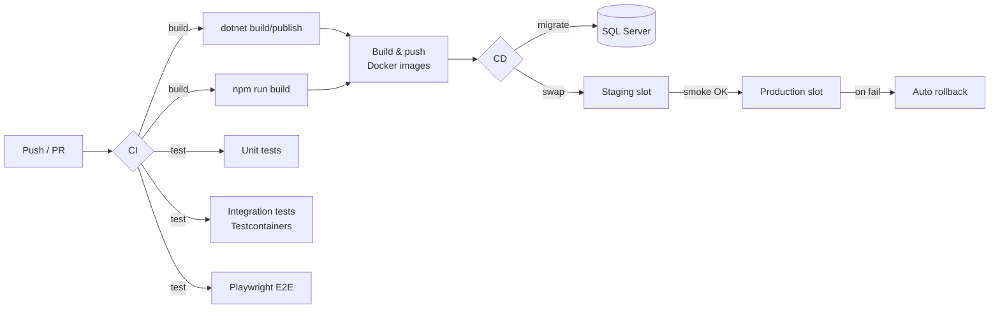

# Topic 12 — CI/CD, Docker & Deployment

> **Goal**: Ship TaskFlow safely and repeatably. Multi-stage Docker images, a Compose stack for local parity, GitHub Actions for build → test → publish → deploy, EF migrations on rollout, blue/green slot swaps, and secrets handled like adults.

---

## 1. The deployment pipeline at a glance



Three principles:
1. **Build once, deploy many.** A single image promotes from CI → staging → prod; configuration is injected at runtime.
2. **Every change ships through the same pipeline.** No manual `dotnet publish` from a laptop.
3. **Zero-downtime by default.** Slot swaps + readiness probes + blue/green make rollback a button click.

---

## 2. Multi-stage Dockerfile for the API

```dockerfile
# syntax=docker/dockerfile:1.7

# ---------- restore layer (cacheable) ----------
FROM mcr.microsoft.com/dotnet/sdk:9.0 AS restore
WORKDIR /src
COPY ["TaskFlow.Api/TaskFlow.Api.csproj", "TaskFlow.Api/"]
COPY ["TaskFlow.Application/TaskFlow.Application.csproj", "TaskFlow.Application/"]
COPY ["TaskFlow.Domain/TaskFlow.Domain.csproj", "TaskFlow.Domain/"]
COPY ["TaskFlow.Infrastructure/TaskFlow.Infrastructure.csproj", "TaskFlow.Infrastructure/"]
COPY ["Directory.Build.props", "Directory.Packages.props", "global.json", "./"]
RUN dotnet restore "TaskFlow.Api/TaskFlow.Api.csproj"

# ---------- build / publish ----------
FROM restore AS build
COPY . .
RUN dotnet publish "TaskFlow.Api/TaskFlow.Api.csproj" \
    -c Release \
    -o /app/publish \
    --no-restore \
    /p:UseAppHost=false

# ---------- runtime (minimal, non-root) ----------
FROM mcr.microsoft.com/dotnet/aspnet:9.0-noble-chiseled AS final
WORKDIR /app
COPY --from=build /app/publish .

USER $APP_UID
EXPOSE 8080
ENV ASPNETCORE_URLS=http://+:8080 \
    DOTNET_RUNNING_IN_CONTAINER=true

HEALTHCHECK --interval=30s --timeout=3s --start-period=20s --retries=3 \
  CMD wget --quiet --tries=1 --spider http://localhost:8080/health/live || exit 1

ENTRYPOINT ["dotnet", "TaskFlow.Api.dll"]
```

**Why each step matters:**
- Separating `restore` from `build` means dependency restore is cached as long as `*.csproj` files don't change.
- `noble-chiseled` is Microsoft's distroless variant: ~100 MB, no shell, no package manager. Smaller surface area, faster pulls.
- `USER $APP_UID` — never run as root in a container.
- `HEALTHCHECK` lets orchestrators decide if the container is healthy without external probes.
- `--no-restore` on `dotnet publish` reuses the cached restore.

---

## 3. Multi-stage Dockerfile for the React app (nginx)

```dockerfile
# syntax=docker/dockerfile:1.7

FROM node:20-alpine AS deps
WORKDIR /app
COPY package*.json ./
RUN --mount=type=cache,target=/root/.npm npm ci

FROM deps AS build
COPY . .
ARG VITE_API_BASE_URL
ENV VITE_API_BASE_URL=$VITE_API_BASE_URL
RUN npm run build

FROM nginx:1.27-alpine AS final
COPY nginx.conf /etc/nginx/conf.d/default.conf
COPY --from=build /app/dist /usr/share/nginx/html
EXPOSE 8080
HEALTHCHECK CMD wget --quiet --tries=1 --spider http://localhost:8080/ || exit 1
```

`nginx.conf` highlights:

```nginx
server {
  listen 8080;
  root /usr/share/nginx/html;

  # SPA fallback — any unknown path returns index.html.
  location / { try_files $uri /index.html; }

  # Cache hashed assets aggressively, never cache index.html.
  location ~* \.(js|css|png|jpg|jpeg|svg|woff2)$ {
    expires 1y; add_header Cache-Control "public, immutable";
  }
  location = /index.html {
    add_header Cache-Control "no-store";
  }

  # Security headers.
  add_header X-Frame-Options DENY;
  add_header X-Content-Type-Options nosniff;
  add_header Referrer-Policy strict-origin-when-cross-origin;
}
```

Build-time env (`VITE_API_BASE_URL`) is baked into the JS bundle — there's no "runtime env" for a static SPA. For multi-environment images, either build per-environment OR ship a small `env.js` loader the SPA reads at startup.

---

## 4. .dockerignore (both API and web)

```
**/bin
**/obj
**/.vs
**/.vscode
**/node_modules
**/dist
**/.git
**/.github
**/*.md
**/*.sln
**/coverage
**/TestResults
**/.env*
**/secrets.json
```

A small build context keeps Docker builds fast and prevents secrets from sneaking into images.

---

## 5. Local docker-compose.yml (full stack)

```yaml
services:
  sqlserver:
    image: mcr.microsoft.com/mssql/server:2022-latest
    environment:
      ACCEPT_EULA: "Y"
      MSSQL_SA_PASSWORD: "Local!SqlPwd123"
      MSSQL_PID: Developer
    ports: ["1433:1433"]
    volumes: [mssql-data:/var/opt/mssql]

  redis:
    image: redis:7-alpine
    ports: ["6379:6379"]

  mailpit:
    image: axllent/mailpit:latest
    ports: ["1025:1025", "8025:8025"]

  api:
    build:
      context: .
      dockerfile: TaskFlow.Api/Dockerfile
    depends_on: [sqlserver, redis, mailpit]
    environment:
      ConnectionStrings__Default: "Server=sqlserver;Database=taskflow;User Id=sa;Password=Local!SqlPwd123;TrustServerCertificate=true"
      ConnectionStrings__Redis: "redis:6379"
      Email__Smtp__Host: "mailpit"
      Email__Smtp__Port: "1025"
      ASPNETCORE_ENVIRONMENT: Development
    ports: ["8080:8080"]

  web:
    build:
      context: ./web
      args:
        VITE_API_BASE_URL: "http://localhost:8080/api/v1"
    ports: ["5173:8080"]
    depends_on: [api]

volumes:
  mssql-data:
```

`docker compose up -d` gives you a one-command full stack identical to production topology — the same images CI builds run here.

---

## 6. EF Core migrations on deploy

Three options, ordered worst → best for production:

| Option | Pros | Cons |
|---|---|---|
| Run on app start (`db.Database.MigrateAsync()`) | Simple | Race condition with multiple replicas; long-running DDL blocks readiness; rollback is impossible |
| **`dotnet ef migrations bundle`** ✓ | Single self-contained binary; runs as a job before app starts | Requires a build step in CI |
| Manual / DBA | Maximum safety | Manual = forgotten = drift |

**Pipeline integration:**

```bash
dotnet ef migrations bundle \
  --project TaskFlow.Infrastructure \
  --startup-project TaskFlow.Api \
  --self-contained -r linux-x64 \
  -o ./artifacts/efbundle
```

In the deploy job, run the bundle as a **pre-deploy hook** against the target DB. If it fails, halt the rollout — the app never starts against an un-migrated schema.

For zero-downtime migrations, follow expand/contract:
1. **Expand** (PR N): add nullable columns, new tables. Old + new code both work.
2. **Migrate** (PR N+1): backfill data, deploy code that uses new columns.
3. **Contract** (PR N+2): drop old columns, add NOT NULL.

Never combine schema changes with breaking code in one release.

---

## 7. GitHub Actions — CI workflow

`.github/workflows/ci.yml`:

```yaml
name: CI
on:
  push: { branches: [main] }
  pull_request: { branches: [main] }

concurrency:
  group: ci-${{ github.ref }}
  cancel-in-progress: true

jobs:
  api:
    runs-on: ubuntu-latest
    steps:
      - uses: actions/checkout@v4
      - uses: actions/setup-dotnet@v4
        with: { dotnet-version: '9.0.x' }

      - run: dotnet restore
      - run: dotnet build -c Release --no-restore
      - run: dotnet test -c Release --no-build --logger "trx;LogFileName=test.trx" --collect:"XPlat Code Coverage"

      - name: Publish coverage
        uses: codecov/codecov-action@v4
        with: { token: ${{ secrets.CODECOV_TOKEN }} }

  web:
    runs-on: ubuntu-latest
    defaults: { run: { working-directory: ./web } }
    steps:
      - uses: actions/checkout@v4
      - uses: actions/setup-node@v4
        with: { node-version: '20', cache: npm, cache-dependency-path: web/package-lock.json }
      - run: npm ci
      - run: npm run lint
      - run: npm run typecheck
      - run: npm test -- --coverage
      - run: npm run build
      - run: npx size-limit

  e2e:
    needs: [api, web]
    runs-on: ubuntu-latest
    services:
      sqlserver:
        image: mcr.microsoft.com/mssql/server:2022-latest
        env: { ACCEPT_EULA: 'Y', MSSQL_SA_PASSWORD: 'Test!SqlPwd123' }
        ports: [1433:1433]
    steps:
      - uses: actions/checkout@v4
      - uses: actions/setup-dotnet@v4
        with: { dotnet-version: '9.0.x' }
      - uses: actions/setup-node@v4
        with: { node-version: '20' }
      - run: dotnet ef database update --project TaskFlow.Infrastructure --startup-project TaskFlow.Api
      - run: dotnet run --project TaskFlow.Api &
      - run: cd web && npm ci && npx playwright install --with-deps && npm run test:e2e

      - if: failure()
        uses: actions/upload-artifact@v4
        with: { name: playwright-trace, path: web/test-results/ }
```

**Notes:**
- `concurrency` cancels superseded runs on the same branch — saves minutes.
- Service containers spin up SQL Server for integration; production uses managed Azure SQL.
- Coverage and traces are uploaded as artifacts on failure for fast triage.

---

## 8. GitHub Actions — image build & push

`.github/workflows/release.yml`:

```yaml
name: Release
on:
  push: { tags: ['v*.*.*'] }

jobs:
  push-images:
    runs-on: ubuntu-latest
    permissions: { contents: read, packages: write, id-token: write }
    steps:
      - uses: actions/checkout@v4
      - uses: docker/setup-buildx-action@v3
      - uses: docker/login-action@v3
        with:
          registry: ghcr.io
          username: ${{ github.actor }}
          password: ${{ secrets.GITHUB_TOKEN }}

      - name: Build & push API
        uses: docker/build-push-action@v6
        with:
          context: .
          file: ./TaskFlow.Api/Dockerfile
          push: true
          tags: |
            ghcr.io/${{ github.repository_owner }}/taskflow-api:${{ github.ref_name }}
            ghcr.io/${{ github.repository_owner }}/taskflow-api:latest
          cache-from: type=gha
          cache-to: type=gha,mode=max
          provenance: true
          sbom: true

      - name: Build & push Web
        uses: docker/build-push-action@v6
        with:
          context: ./web
          push: true
          build-args: VITE_API_BASE_URL=${{ vars.VITE_API_BASE_URL }}
          tags: |
            ghcr.io/${{ github.repository_owner }}/taskflow-web:${{ github.ref_name }}
            ghcr.io/${{ github.repository_owner }}/taskflow-web:latest
          cache-from: type=gha
          cache-to: type=gha,mode=max
```

`provenance: true` + `sbom: true` produce supply-chain attestations and a software bill of materials — increasingly required for enterprise customers.

---

## 9. GitHub Actions — deploy with slot swap (Azure App Service)

```yaml
name: Deploy
on:
  workflow_run:
    workflows: [Release]
    types: [completed]

jobs:
  deploy:
    if: ${{ github.event.workflow_run.conclusion == 'success' }}
    runs-on: ubuntu-latest
    environment: production    # gates with required reviewers + secrets
    steps:
      - uses: actions/checkout@v4
      - uses: azure/login@v2
        with:
          client-id:       ${{ secrets.AZURE_CLIENT_ID }}
          tenant-id:       ${{ secrets.AZURE_TENANT_ID }}
          subscription-id: ${{ secrets.AZURE_SUBSCRIPTION_ID }}

      # Run EF migrations bundle against prod DB.
      - run: ./artifacts/efbundle --connection "${{ secrets.SQL_CONN }}"

      # Deploy to staging slot.
      - uses: azure/webapps-deploy@v3
        with:
          app-name: taskflow-api
          slot-name: staging
          images: ghcr.io/${{ github.repository_owner }}/taskflow-api:${{ github.event.workflow_run.head_branch }}

      # Smoke test staging slot.
      - run: |
          for i in {1..30}; do
            if curl -fs https://taskflow-api-staging.azurewebsites.net/health/ready; then exit 0; fi
            sleep 5
          done
          exit 1

      # Swap into production.
      - run: az webapp deployment slot swap -n taskflow-api -g taskflow-rg --slot staging --target-slot production
```

**Key safety rails:**
- `environment: production` requires manual approval + scopes secrets to that environment.
- OIDC federation (`azure/login@v2` with no client secret) eliminates long-lived credentials.
- The smoke loop confirms readiness BEFORE the swap; if it fails, prod is untouched.
- A bad swap is reversed with `az webapp deployment slot swap ... --slot production --target-slot staging`.

---

## 10. Secrets management

| Layer | Tool | Rotates? |
|---|---|---|
| CI/CD | GitHub Actions Environments + Encrypted secrets | Manual |
| Cloud | Azure Key Vault (or AWS Secrets Manager) | Auto |
| Runtime | Managed identity → Key Vault references in App Service config | N/A |
| Local dev | `dotnet user-secrets`, never `appsettings.json` | N/A |

**Never** check secrets into git. Wire pre-commit `gitleaks` and a GitHub Actions `gitleaks-action` to fail PRs that try.

App Service config supports Key Vault references:
```
@Microsoft.KeyVault(SecretUri=https://kv-taskflow-prod.vault.azure.net/secrets/jwt-signing-key/)
```
The app reads it through plain `IConfiguration` — no SDK changes required.

---

## 11. Hosting choices

| Option | Best for | Notes |
|---|---|---|
| **Azure App Service** (Linux, Containers) | Most teams | Easiest slot swap; built-in autoscale; first-class Application Insights |
| **Azure Container Apps** | Microservices, KEDA-driven scale, scale-to-zero | Cheaper at low traffic; revision management |
| **Azure Kubernetes Service (AKS)** | Existing K8s competency | Highest power & complexity |
| **Static Web Apps + Functions** | Pure SPA + a few APIs | Cheapest for low traffic |
| **Vercel / Netlify (frontend) + App Service (API)** | Frontend perf | Edge CDN baked in |

For TaskFlow we use App Service for both API container and web container — boring, reliable, fast slot swaps.

---

## 12. Observability hookup in deploy

- Connect App Service to Application Insights with `APPLICATIONINSIGHTS_CONNECTION_STRING` (Key Vault reference).
- The OTLP exporter (Topic 11) auto-targets App Insights when this var is set.
- Log Analytics workspace receives Serilog console output + container stdout.
- Configure availability tests against `/health/ready` and `/api/v1/projects` from 5 regions.
- Alert rules: error rate >2% in 5 min, p95 >500 ms in 5 min, dependency failures >5%.

---

## 13. Versioning & release notes

- **Semantic versioning** for the Docker image: tag pushes (`v1.4.0`) drive `Release.yml`.
- Use **`release-please`** or **Conventional Commits** to auto-generate `CHANGELOG.md` and bump versions:

```yaml
- uses: googleapis/release-please-action@v4
  with: { release-type: simple, package-name: taskflow }
```

The bot opens a PR. Merge it → tag → release pipeline → deploy.

---

## 14. Branch protection rules

For `main`:
- Require PR + 1 approval (2 for production-critical paths via `CODEOWNERS`).
- Require all status checks: `api`, `web`, `e2e`, `gitleaks`, `size-limit`.
- Require linear history (no merge commits) — keeps `git log` reviewable.
- Require signed commits.
- Block force pushes & deletions.

`CODEOWNERS` makes security-sensitive files (`Program.cs`, `*.Dockerfile`, `.github/workflows/`) require platform-team review.

---

## 15. Rollback strategy

Three layers, fastest first:

1. **Slot swap back** (`az webapp deployment slot swap`) — < 30 s.
2. **Re-deploy previous image tag** (`v1.3.9`) — 2–3 min.
3. **DB rollback** — only if a destructive migration was applied. Best avoided via expand/contract (Section 6).

Keep the **last 3 image tags** in your registry. Don't delete them just because they're "old" — they're your rollback inventory.

---

## 16. Common pitfalls

| Pitfall | Fix |
|---|---|
| Image runs as root | `USER $APP_UID` (chiseled images) or `USER 1000` |
| `latest` tag in production | Pin to immutable tag (`v1.4.0` or sha256 digest) |
| Running EF `MigrateAsync()` on app start with N replicas | DDL race; use migrations bundle as a pre-deploy job |
| Storing Azure secrets in `appsettings.Production.json` | Key Vault reference + managed identity |
| No readiness probe → traffic before warm-up | Map `/health/ready` and configure App Service health check |
| Build context includes `node_modules`/`bin` | Tighten `.dockerignore` |
| Build-time env baked wrong for the environment | Build per-env tags, OR ship runtime `env.js` loader |
| Pipeline takes 30 min | Cache restore, parallelize jobs, ditch unnecessary `actions/cache` for `cache-dependency-path` instead |

---

## 17. 10 Q&A

1. **Why multi-stage Docker builds?** They keep the runtime image tiny (no SDK, no source) while still using one Dockerfile for the whole pipeline.
2. **Why `noble-chiseled` instead of `aspnet:9.0`?** Distroless: no shell, no package manager, smaller attack surface, faster pulls.
3. **What's wrong with `db.Database.MigrateAsync()` on app start?** Race conditions across replicas, no rollback, blocks readiness; use `migrations bundle` as a pre-deploy step.
4. **Slot swap vs. re-deploy?** Slot swap is near-instant warm traffic shift; re-deploy is a fresh rollout. Slot swap is the default for App Service.
5. **Why prefer OIDC federation over service principal secrets?** No long-lived credentials in GitHub; tokens are short-lived per workflow run.
6. **Build-time vs. runtime config for the SPA?** Vite bakes `VITE_*` at build. For multi-env from one image, either build per-env or load `env.js` at runtime.
7. **What's `concurrency.cancel-in-progress` for?** Cancels an in-flight CI run when a newer commit lands on the same branch — saves minutes & queue time.
8. **What does `provenance: true` give you?** Cryptographic build provenance (where/when/how the image was built) — required for SLSA Level 3 compliance.
9. **Why ban `latest` in production?** It's mutable. Two pods could pull different bits. Always pin to a version or digest.
10. **How do you do zero-downtime DB changes?** Expand → migrate → contract across releases; never combine schema breakage with code that depends on the new shape.
