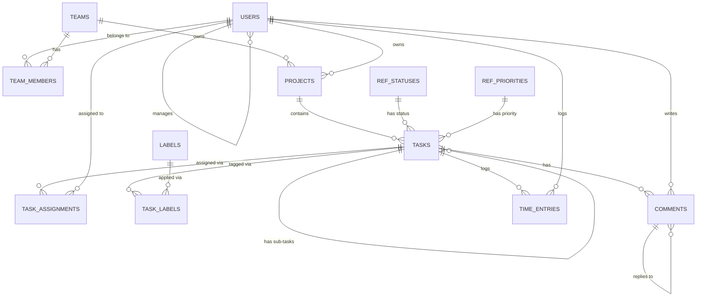

# Topic 12: Normalization & Database Design

> The seeded `TaskFlowDb` schema you have been querying since Topic 01 did not arrive by accident. Every table split, every junction table, every self-referencing foreign key is the output of a design process — and that process has a name: normalization. This topic works backward from a deliberately bad "spreadsheet" version of TaskFlow to the schema you already know, names the anomalies each step removes, then works forward again into ER modelling, key strategy, hierarchies, temporal data, multi-tenancy and the anti-patterns that put you back where you started.

---

## 1. Functional Dependencies

A **functional dependency** `A → B` means: for a given value of `A`, there is exactly one value of `B`. `A` is a **determinant**.

| Term | Meaning |
|---|---|
| **Full dependency** | `B` depends on the *whole* of a composite key `(A1, A2)`, not just part of it |
| **Partial dependency** | `B` depends on only *part* of a composite key — `(A1, A2) → B` but really `A1 → B` |
| **Transitive dependency** | `A → B` and `B → C`, so `A → C` indirectly, through a non-key column |
| **Candidate key** | A minimal set of columns that functionally determines every other column |
| **Prime attribute** | A column that is part of **any** candidate key |
| **Non-prime attribute** | Everything else |

In `app.Tasks`: `TaskId → Title, ProjectId, StatusId, …` (every column) — `TaskId` is a candidate key (and the only one; there is no natural alternate key here). In `app.TaskAssignments`, the primary key is composite `(TaskId, UserId)`, and `IsPrimary`/`AssignedOn` depend on the *pair* — a full dependency. If `AssignedOn` depended on `TaskId` alone (say, "the date the task was created," which every assignment row would share for a given task), that would be a **partial** dependency and a 2NF violation.

---

## 2. The Anomalies Normalization Prevents

Imagine TaskFlow had shipped as one denormalized table instead of the seeded schema:

```
TaskReport(TaskId, Title, ProjectCode, ProjectName, ProjectBudget,
           AssigneeEmail, AssigneeFullName, AssigneeHourlyRate, LabelName)
```

One row per (task, assignee, label) combination — task 4 has 2 assignees and 2 labels, so it appears **4 times**.

| Anomaly | What goes wrong | Concrete example |
|---|---|---|
| **Insert** | Can't record a fact until an unrelated fact also exists | Can't add a new project until it has a task, because `ProjectName`/`ProjectBudget` only exist as columns *on a task row* |
| **Update** | The same fact is stored in multiple places and can drift | Renaming `TF-CORE` requires updating `ProjectName` on every one of its 9 tasks × assignees × labels rows — miss one and the project now has two names |
| **Delete** | Deleting one fact accidentally destroys an unrelated fact | Deleting task 33's only row (it has no labels, one assignee) is fine, but deleting the *last* row that mentions a project deletes all knowledge that project ever existed |

Normalization fixes all three by ensuring **every fact is stored in exactly one place** — a project's name lives only in `app.Projects`, a label's color only in `app.Labels`.

---

## 3. First Normal Form (1NF)

**Definition:** every column holds a single, atomic value from its domain; no repeating groups; every row is uniquely identifiable.

```
-- VIOLATION: comma-separated multi-value column
Tasks_Bad(TaskId, Title, AssigneeEmails)
1, 'Design DB schema', 'grace.hopper@taskflow.io,linus.torvalds@taskflow.io'
```

You cannot index, join, filter (`WHERE AssigneeEmails LIKE '%grace%'` is a scan, never a seek), or enforce a foreign key against a comma-separated list. The 1NF fix is exactly `app.TaskAssignments` — one row per (task, assignee) pair, each value atomic.

```sql
-- 1NF, correctly modelled: one row per assignment, each column atomic.
SELECT ta.TaskId, u.Email FROM app.TaskAssignments AS ta JOIN app.Users AS u ON u.UserId = ta.UserId;
```

> **Portability:** PostgreSQL's `ARRAY`/`JSONB` columns and SQL Server's own JSON support make it *possible* to store a repeating group without violating 1NF outright (the column is technically one value — a document), but every problem above resurfaces the moment you need to query, index, or constrain the individual elements.

---

## 4. Second Normal Form (2NF)

**Definition:** already in 1NF, and every non-key column depends on the **whole** primary key — no partial dependencies. 2NF is only a meaningful question for tables with a **composite** primary key.

```
-- VIOLATION: composite key (TaskId, LabelId), but LabelColor depends only on LabelId.
TaskLabels_Bad(TaskId, LabelId, LabelColor)
```

`LabelColor` is a partial dependency — it depends on `LabelId` alone, not on `(TaskId, LabelId)` together. Update anomaly: change one task's label color and every *other* task sharing that label now (correctly) has a different color than expected, or you forget one and they drift. The fix is exactly the seeded design: split `LabelColor` out into `app.Labels`, leaving `app.TaskLabels(TaskId, LabelId)` as a pure junction with no non-key columns to violate anything.

---

## 5. Third Normal Form (3NF)

**Definition:** already in 2NF, and every non-key column depends on the key, the **whole** key, and **nothing but** the key — no transitive dependencies through another non-key column.

```
-- VIOLATION: ProjectName depends on ProjectId, not on TaskId directly.
Tasks_Bad2(TaskId, Title, ProjectId, ProjectName, ProjectBudget)
```

`TaskId → ProjectId → ProjectName` is transitive. Update anomaly: renaming a project means updating `ProjectName` on every task row that references it. The fix is the seeded design — `ProjectName`/`Budget` live only in `app.Projects`; `app.Tasks` carries just the foreign key `ProjectId`.

> **The classic exam mnemonic:** *"The key, the whole key, and nothing but the key, so help me Codd."* 1NF removes repeating groups, 2NF removes partial dependencies on part of a composite key, 3NF removes transitive dependencies through a non-key column.

---

## 6. Boyce-Codd Normal Form (BCNF)

**Definition:** already in 3NF, and for **every** functional dependency `X → Y`, `X` must be a **candidate key** — no exceptions, even for prime attributes. BCNF is strictly stronger than 3NF and only differs from it when a table has **multiple overlapping candidate keys**.

```
-- A hypothetical: one instructor teaches exactly one subject; a subject may have
-- several instructors; a room+time slot has exactly one subject.
Teaching(RoomTimeSlot, Subject, Instructor)
-- Candidate keys: (RoomTimeSlot, Instructor) and (RoomTimeSlot, Subject) -- both work.
-- But Instructor -> Subject holds, and Instructor is NOT a candidate key by itself.
-- This is 3NF (Subject is prime, so the transitive-dependency test doesn't fire)
-- but violates BCNF, because Instructor -> Subject and {Instructor} isn't a key.
```

TaskFlow has no naturally-occurring BCNF violation in its seeded schema — this level mostly shows up in the "multiple candidate keys with overlapping dependencies" shape above, which is rare in ordinary line-of-business schemas but a favourite interview question. The fix, when it occurs, is to decompose into `Teaching(Instructor, Subject)` and `Bookings(RoomTimeSlot, Instructor)` — and this is also the textbook case where BCNF decomposition can **lose dependency preservation** (you can no longer check `RoomTimeSlot → Subject` with a single-table constraint; it now requires a join).

---

## 7. Fourth and Fifth Normal Form (4NF, 5NF)

**4NF** — no **multi-valued dependencies** that aren't also functional ones. A multi-valued dependency exists when two independent multi-valued facts are forced into the same table, creating a spurious combinatorial explosion.

```
-- VIOLATION: a task's assignees and its labels are INDEPENDENT of each other, but
-- cramming both into one table forces every assignee to be paired with every label.
TaskFacts_Bad(TaskId, AssigneeUserId, LabelId)
-- Task 4 has 2 assignees x 2 labels = 4 rows, even though "who's assigned" and
-- "what labels apply" have nothing to do with each other.
```

The fix is exactly the seeded design: two independent junction tables, `app.TaskAssignments(TaskId, UserId)` and `app.TaskLabels(TaskId, LabelId)`, each capturing one multi-valued fact. This is the normal form that explains *why TaskFlow has two junction tables off `app.Tasks` instead of one wide one*.

**5NF** (project-join normal form) — a table can be split into three or more smaller tables whose join, and *only* their join, reconstructs the original with no spurious rows. It matters almost exclusively for genuine three-way business rules (e.g. "supplier S can supply part P; project J needs part P; supplier S is approved for project J — but that does *not* imply S actually supplies P to J") and essentially never appears by accident in line-of-business schemas. Know the name and the shape for an interview; do not go looking for it in ordinary designs.

| Form | Removes | TaskFlow example |
|---|---|---|
| 1NF | Repeating groups / non-atomic values | `AssigneeEmails` comma list → `app.TaskAssignments` |
| 2NF | Partial dependency on part of a composite key | `LabelColor` on `(TaskId, LabelId)` → `app.Labels` |
| 3NF | Transitive dependency through a non-key column | `ProjectName` via `ProjectId` → `app.Projects` |
| BCNF | Determinant that isn't a candidate key | Overlapping-key edge case (rare in practice) |
| 4NF | Independent multi-valued facts crammed together | Assignees + labels → two junction tables |
| 5NF | Join dependency not implied by simpler keys | Genuine 3-way business rules (rare) |

---

## 8. Denormalization

Normalization optimizes for **write correctness** (one fact, one place). Some workloads — dashboards, reporting, high-read APIs — optimize for **read speed** instead, and deliberately reintroduce redundancy.

| Technique | What it does | Cost | Correctness safeguard |
|---|---|---|---|
| **Materialised/cached rollup column** | Store `app.Projects.OpenTaskCount` instead of computing it every read | Must be kept in sync on every task insert/status change | Trigger, or scheduled job with a documented staleness window |
| **Indexed view** | A view whose result set is physically stored and auto-maintained | Write overhead on every base-table change; `WITH SCHEMABINDING` required | The engine keeps it correct automatically |
| **Reporting/star schema copy** | A separate, deliberately denormalized copy for analytics (Topic 18/20 territory) | ETL lag; two schemas to maintain | Explicitly documented as eventually consistent |
| **Duplicated foreign-key-adjacent column** | Store `app.Tasks.ProjectCode` alongside `ProjectId` to avoid a join in a hot query | Must update both if `ProjectCode` ever changes | Trigger, or treat the source column as immutable |

> **Rule of thumb:** Denormalize deliberately, in writing, with a stated mechanism for keeping the copy correct. Denormalizing by accident — two tables that happen to both store a project's name, with no defined owner — is not an optimization, it is the update anomaly from §2 with a different name.

---

## 9. ER Modelling

Entity-relationship modelling describes *entities* (things), *attributes* (their properties) and *relationships* (how entities connect), with **cardinality** (1:1, 1:N, N:M) and **participation** (mandatory vs optional) on each end.



Crow's-foot reading: `||` = exactly one (mandatory), `o{` = zero-or-many (optional many). `USERS ||--o{ USERS` reads "one user manages zero-or-many users" — the self-referencing hierarchy from Topic 07. `TASKS ||--o{ TASK_ASSIGNMENTS` combined with `USERS ||--o{ TASK_ASSIGNMENTS` is the standard shape for resolving the M:N relationship between tasks and users through a junction entity.

### Weak entities and identifying relationships

A **weak entity** cannot exist without its owner and has no identity of its own outside that ownership — `app.TeamMembers` and `app.TaskAssignments` are weak entities: a membership row makes no sense without both a team and a user, and its primary key is entirely composed of its parents' keys (an **identifying relationship**). Contrast with `app.Comments`, which has its own surrogate `CommentId` and is a strong entity, even though it also has a mandatory foreign key to `app.Tasks` — the relationship is mandatory, but not identifying, because `CommentId` alone identifies the row.

---

## 10. Resolving Many-to-Many Relationships

A relational database has no native way to store "many tasks have many labels" directly — both sides would need a multi-valued column, which violates 1NF (§3). The universal fix is a **junction table** (also called an associative or bridge table) holding one row per pairing:

```sql
-- app.TaskLabels: the M:N junction between app.Tasks and app.Labels.
CREATE TABLE app.TaskLabels (
    TaskId  INT NOT NULL,
    LabelId INT NOT NULL,
    CONSTRAINT PK_TaskLabels PRIMARY KEY (TaskId, LabelId),
    CONSTRAINT FK_TaskLabels_Task  FOREIGN KEY (TaskId)  REFERENCES app.Tasks (TaskId)  ON DELETE CASCADE,
    CONSTRAINT FK_TaskLabels_Label FOREIGN KEY (LabelId) REFERENCES app.Labels (LabelId) ON DELETE CASCADE
);
```

The composite primary key `(TaskId, LabelId)` does double duty: it is the row's identity **and** a uniqueness constraint preventing the same label being attached to the same task twice. `app.TeamMembers` follows the identical pattern for the M:N between `app.Teams` and `app.Users`, with extra payload columns (`RoleName`, `JoinedOn`) hanging off the pairing — exactly the shape that motivated 2NF in §4.

---

## 11. Surrogate vs Natural Keys

| | Natural key | Surrogate key (`IDENTITY`) | Surrogate key (`GUID`) |
|---|---|---|---|
| Example | `Email`, `ProjectCode` | `UserId INT IDENTITY` | `UserId UNIQUEIDENTIFIER` |
| Meaningful to the business | Yes | No | No |
| Can change over time | Sometimes (risky as a PK) | Never | Never |
| Storage | Variable, often wider | 4/8 bytes | 16 bytes |
| Clustering behaviour | Depends on value pattern | **Sequential — ideal clustering key** | Random — index fragmentation (Topic 13) unless `NEWSEQUENTIALID()` |
| Merge-friendly across databases | No | No (collision risk) | **Yes** — globally unique without coordination |
| Exposed in URLs/APIs safely | Sometimes leaks meaning | Leaks row count/creation order | Opaque |

TaskFlow uses `IDENTITY` surrogates everywhere (`UserId`, `TaskId`, `ProjectId`, …) and keeps natural keys as **alternate keys** via `UNIQUE` constraints (`UQ_Users_Email`, `UQ_Projects_Code`) — the standard pattern: a stable, narrow, sequential surrogate for joins and clustering, with the business-meaningful value still enforced unique for lookups and de-duplication.

> **Rule of thumb:** Composite natural keys (e.g. `(CountryCode, PostalCode)`) are legitimate for pure lookup/reference tables, but avoid them as the primary key of a table with children — every child row must then repeat the whole composite key, and every join gets wider.

---

## 12. Modelling Hierarchies

Four ways to store a tree, each with different trade-offs — all discussed in depth for the recursive-CTE case in Topic 07:

| Model | Storage | Find descendants | Find ancestors | Move a subtree | TaskFlow example |
|---|---|---|---|---|---|
| **Adjacency list** | One `ParentId` column | Recursive CTE (O(depth) round trips) | Recursive CTE (O(depth)) | O(1) — change one row | `app.Users.ManagerId`, `app.Tasks.ParentTaskId` |
| **Path enumeration** | A string column, e.g. `/1/4/17/` | `LIKE '/1/4/%'` — one index seek | Split the string | Requires rewriting every descendant's path | Not used in seeded schema; common in CMS/file-tree systems |
| **Nested sets** | `Lft`/`Rgt` integer bounds per node | One range query, no recursion | One range query | **Expensive** — renumbers a large portion of the tree | Rare outside read-heavy, rarely-mutated trees |
| **Closure table** | A separate table with one row per (ancestor, descendant, depth) pair, including self-pairs | One indexed join, no recursion | One indexed join | O(subtree size) rows to update | Common in large, deep, frequently-queried hierarchies |
| **`HIERARCHYID`** | SQL Server's built-in compact hierarchical type | Built-in `IsDescendantOf()`, indexable | Built-in | `GetReparentedValue()` | Alternative to adjacency list when the hierarchy is queried far more than it's written |

> **Rule of thumb:** Start with adjacency list — it is simple, matches how the business actually edits the data (reassign one manager, reparent one task), and Topic 07 already showed the recursive CTE handles it well. Reach for path enumeration or a closure table only when you have *measured* that read performance on deep, frequently-queried hierarchies is the actual bottleneck.

---

## 13. Modelling Temporal and Slowly-Changing Data

| SCD Type | Behaviour | TaskFlow example |
|---|---|---|
| **Type 1** | Overwrite in place; history is lost | `app.Users.JobTitle` today — a promotion just overwrites the old title |
| **Type 2** | Insert a new row, mark the old one inactive/effective-dated | Tracking a user's `HourlyRate` history for accurate historical cost reports |
| **Type 3** | Add a `PreviousX` column alongside the current one | Keep only "current" and "previous" department, nothing further back |

A Type 2 extension of `app.Users` would add `EffectiveFrom`, `EffectiveTo` (NULL = current), and a surrogate row key distinct from the business `UserId`:

```sql
-- Illustrative Type 2 shape -- not part of the seeded schema.
CREATE TABLE app.UserRateHistory (
    UserRateHistoryId INT IDENTITY PRIMARY KEY,
    UserId            INT NOT NULL REFERENCES app.Users (UserId),
    HourlyRate        DECIMAL(9,2) NOT NULL,
    EffectiveFrom     DATETIME2(3) NOT NULL,
    EffectiveTo       DATETIME2(3) NULL       -- NULL = currently in effect
);
```

SQL Server's **system-versioned temporal tables** (Topic 18) automate exactly this pattern — a hidden history table plus `FOR SYSTEM_TIME AS OF` querying — without hand-rolling `EffectiveFrom`/`EffectiveTo` logic. This topic introduces the *concept*; Topic 18 covers the syntax.

**Soft delete vs hard delete vs archive table:**

| Approach | Mechanism | Query impact | Storage growth |
|---|---|---|---|
| **Hard delete** | `DELETE` the row | None — row is gone | None |
| **Soft delete** | `IsDeleted BIT` / `DeletedAtUtc` column, filtered out by default | Every query needs `WHERE IsDeleted = 0`, or a view/filtered index that enforces it | Grows forever unless purged |
| **Archive table** | Move the row to a parallel `*_Archive` table on delete | Active table stays small and fast; a `UNION` is needed to query "everything ever" | Same total, split across two tables |

`app.Tasks.IsArchived` in the seeded schema is a soft-delete-flavoured flag at the *project* level, not the task level — TaskFlow chose to archive whole projects, not individual tasks, which is a deliberate scope decision worth noticing.

---

## 14. Multi-Tenancy Models

| Model | Isolation | Cost per tenant | Cross-tenant query | Blast radius of a bug |
|---|---|---|---|---|
| **Shared schema + `TenantId` column** | Row-level, via `WHERE TenantId = @Current` everywhere (or a security policy) | Lowest — one schema, one set of tables | Trivial (just omit the filter) | **High** — one missing filter leaks every tenant's data |
| **Schema-per-tenant** | Database-schema boundary | Moderate — N schemas, shared database/maintenance | Requires dynamic SQL or cross-schema views | Medium |
| **Database-per-tenant** | Full database boundary | Highest — N databases, N sets of backups/maintenance | Requires cross-database queries or ETL | **Low** — a bug in tenant A's queries cannot touch tenant B's database |

TaskFlow's seeded schema is implicitly single-tenant (no `TenantId` column anywhere). Adding multi-tenancy later means choosing one of these three, and the shared-schema option — the cheapest to run — is also the one where a forgotten `WHERE TenantId = @Current` is a data breach, not just a bug; row-level security (a `SECURITY POLICY` with a predicate function) is the standard mitigation for that specific failure mode.

---

## 15. OLTP vs OLAP, Star vs Snowflake

| | OLTP (TaskFlowDb itself) | OLAP (a `TF-RPT` reporting warehouse) |
|---|---|---|
| Optimized for | Fast, correct, concurrent writes | Fast aggregate reads over huge historical volumes |
| Schema shape | Normalized (3NF) | **Denormalized** — star or snowflake |
| Typical query | "Update this one task's status" | "Total logged hours by month, by team, by priority, for two years" |
| Update frequency | Constant | Batch-loaded (ETL), rarely updated in place |

A **star schema** for TaskFlow's reporting project (`TF-RPT`, seen in Topics 05/09) would have one **fact** table at a defined **grain** and several **dimension** tables:

```
FactTimeEntry (grain: one row per time entry)
    DateKey, TaskKey, UserKey, ProjectKey, Hours, Cost
DimDate     (DateKey, CalendarDate, Month, Quarter, Year, IsWeekend)
DimTask     (TaskKey, Title, PriorityName, StatusName)   -- denormalized: priority/status inlined
DimUser     (UserKey, FullName, JobTitle, Department)
DimProject  (ProjectKey, ProjectCode, ProjectName, TeamName)
```

A **snowflake schema** normalizes the dimensions further (`DimProject` referencing a separate `DimTeam`, instead of inlining `TeamName`) — trading a bit more join complexity for less dimension redundancy. TaskFlow's OLTP schema *is* effectively a heavily-normalized snowflake already; a reporting warehouse built from it would deliberately flatten `ref.TaskStatuses`/`ref.Priorities`/`app.Teams` into their fact-adjacent dimensions, because OLAP optimizes for read simplicity over write correctness (§8's trade-off, applied at schema-design scale).

---

## 16. Naming Conventions and a Design Review Checklist

TaskFlow's conventions, already visible throughout the seeded schema:

- **Tables:** `PascalCase`, plural (`Tasks`, `Users`), schema-qualified (`app.`, `ref.`, `audit.`).
- **Columns:** `PascalCase`, singular, no table-name prefix (`Title`, not `TaskTitle`) except foreign keys, which repeat the parent's key name (`ProjectId`, `ManagerId`).
- **Constraints:** `PK_`, `FK_`, `UQ_`, `CK_`, `DF_` prefixes, followed by table and column/purpose (`FK_Tasks_Project`, `CK_TimeEntries_Hours`).
- **Booleans:** `Is`/`Has` prefix (`IsActive`, `IsTerminal`, `IsPrimary`, `IsBillable`).
- **Timestamps:** `*AtUtc` suffix, always UTC, always `DATETIME2` (Topic 02, Topic 04).

Before shipping a new table, check:

- [ ] Every table has a primary key (surrogate, unless it is a pure junction table).
- [ ] Every foreign key has an explicit, deliberate `ON DELETE`/`ON UPDATE` action (Topic 11).
- [ ] Every column is in the smallest correct data type (Topic 02) — no `NVARCHAR(MAX)` for a status code.
- [ ] The table is in at least 3NF, or the denormalization is deliberate and documented (§8).
- [ ] Every M:N relationship goes through a junction table, never a delimited list (§3, §10).
- [ ] Nullable columns have a documented meaning for NULL, or should be `NOT NULL` with a `DEFAULT`.
- [ ] Naming matches the conventions above.

---

## 17. Anti-Pattern Gallery

| Anti-pattern | What it looks like | Why it's wrong | Fix |
|---|---|---|---|
| **EAV (Entity-Attribute-Value)** | `Attributes(EntityId, AttributeName, AttributeValue)` for every property of every entity | No types, no constraints, every query is a self-join per attribute, `AttributeValue` is always a string | Real columns for known attributes; `MetadataJson` (already in `app.Tasks`) for genuinely dynamic, sparse, unindexed extras |
| **One-true-lookup-table** | `Lookups(LookupType, Code, Description)` serving every reference list in the system | No foreign key can target a *specific* type; a `Priority` FK can't stop someone attaching a `Country` row | Separate tables per concept (`ref.TaskStatuses`, `ref.Priorities`, as seeded) |
| **Comma-separated multi-values** | `AssigneeEmails NVARCHAR(MAX)` | Violates 1NF (§3); unindexable, unjoinable | A junction table |
| **Over-use of `NVARCHAR(MAX)`** | Every column oversized "just in case" | Prevents online index operations pre-2016 in some cases, wastes row space, defeats `CHECK` on length, signals no domain analysis was done | Size columns to the actual domain (Topic 02) |
| **"No FKs, for performance"** | Referential integrity enforced only in application code | Any bypass (ETL, hotfix script, bug) corrupts data invisibly; also loses **join elimination** (Topic 11 §5) | Trusted foreign keys — the write-time cost is real but small, and the read-time/correctness benefit is larger |
| **Polymorphic foreign keys** | `Comments(CommentableType, CommentableId)` pointing at either `Tasks` or `Projects` depending on a string | The database cannot enforce that `CommentableId` actually exists in the right table — no real foreign key is possible | Separate junction/comment tables per parent type, or a supertype table both `Tasks` and `Projects` reference |

---

## Mental Model

> Normalization is a mechanical test, not a taste: for every table, ask whether a non-key column depends on the whole key (2NF), only the key (3NF), and nothing transitively borrowed from another non-key column — and the moment you find a column that would need updating in more than one row to record one fact, you have found the anomaly the next normal form removes. TaskFlow's schema is the *output* of that process, not an arbitrary design: `app.Labels` exists because color is a fact about a label, not about a task; `app.TaskLabels` and `app.TaskAssignments` are two separate junction tables, not one wide one, because "who's assigned" and "what's labelled" are independent multi-valued facts (4NF); `ProjectName` lives once, in `app.Projects`, because a transitive dependency through `ProjectId` would let two tasks disagree about their own project's name. Denormalization is the deliberate, documented reversal of this — acceptable for reporting and read-heavy paths, dangerous the moment it happens by accident with no owner keeping the copies in sync. And the modelling decisions above the level of a single table — surrogate vs natural keys, which hierarchy representation, soft delete vs archive, shared schema vs database-per-tenant — are all the same trade-off in different clothes: less structure is cheaper to build and more dangerous to get wrong; more structure costs more upfront and fails safer.

Move to [Practice Problems](./Practice-Problems.md).
