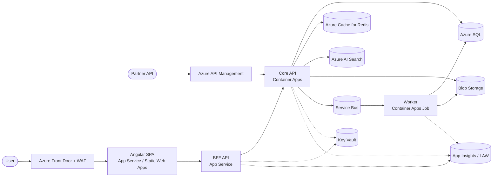

# 01 — Requirements & Architecture

## 1. Personas

| Persona | Goals | Pain today |
|---|---|---|
| **Engineer (member)** | See my tasks, update status, comment | Too many tools; lost context |
| **Lead (admin)** | Plan sprint, track throughput, unblock | No real-time visibility |
| **Stakeholder (viewer)** | See what's shipping | No read-only view |
| **Platform engineer** | Onboard a new tenant in < 1 hour | Manual setup |
| **SecOps** | Audit access; prove compliance | No central evidence |

## 2. User Stories (selected)

Use the format **As a … I want … so that …**, with an **AC** list.

### Auth & tenancy
- **US-1** As an admin I want to invite a user to my tenant so that they can access my workspace.
  - AC: invite email sent; expires in 7d; one-time use; user lands in correct tenant.
- **US-2** As an engineer I want to switch between tenants I'm in so that I can work for two clients in one session.
  - AC: tenant picker; switching reissues access token with new tenant claim; no data leak across tenants.

### Tasks
- **US-3** As an engineer I want to create / edit / move tasks on a kanban board.
- **US-4** As an engineer I want to attach a file (< 25 MB) to a task.
- **US-5** As an engineer I want to be notified (email + in-app) when a task is assigned to me.

### Search & reporting
- **US-6** As a lead I want to full-text search across tasks I can see.
- **US-7** As a lead I want a dashboard of throughput / WIP / cycle-time.

### Platform
- **US-8** As a platform engineer I want to vend a new tenant via PR so that onboarding is < 1 hour.
- **US-9** As SecOps I want a weekly compliance report so that I can prove < 95% drift.

(Author the full set — aim for 15–20 stories before you start.)

## 3. Non-Functional Requirements

| Category | Requirement |
|---|---|
| **Availability** | 99.5% read, 99.0% write monthly |
| **Latency** | P95 read < 300 ms, P95 write < 600 ms |
| **Throughput (steady)** | 50 RPS / tenant; soft cap |
| **RPO** | 15 min |
| **RTO** | 1 hour |
| **Retention** | 7 years for audit; 90 days for app logs hot, 1 year archive |
| **Security** | OWASP ASVS L2; SOC 2 control mapping documented |
| **Privacy** | Data classification per field; tenant data isolation enforced |
| **Cost** | Idle dev env < £40/month; prod scale-cost documented |
| **Accessibility** | WCAG 2.2 AA |
| **Browser support** | Last 2 versions Chrome/Edge/Firefox/Safari |
| **Build / deploy** | PR build < 10 min; deploy < 20 min |

## 4. Architecture (Container View)



### Data flow notes
- SPA is **cookie-authed** via BFF; tokens never leave the server.
- BFF exchanges user token for downstream Core API token (OBO).
- Partners use APIM with subscription keys + JWT validation.
- All eastbound traffic uses **Managed Identity**; no connection strings in app settings.
- Service Bus carries domain events (`TaskCreated`, `TaskAssigned`, …) for the worker.

## 5. Domain Model (selected)

```
Tenant 1───* User
Tenant 1───* Project 1───* Board 1───* Column 1───* Card
Card 1───* Comment
Card 1───* Attachment
Card *───* Label
User 1───* Notification
```

Aggregate boundaries:
- **Tenant** — root for all tenancy invariants.
- **Project** — root for membership, settings, columns.
- **Card** — root for assignment, comments, attachments.
- **Notification** — root; eventually consistent.

Concurrency: optimistic via `rowversion` on Card; reject 409 with current state.

## 6. C4 Diagrams to Produce

1. **System Context** — TaskFlow + users + Entra + partners + email provider.
2. **Container** — the diagram in §4 above, refined.
3. **Component** — Core API: Controllers → Application services → Domain → Infrastructure.
4. **Deployment** — Azure resources in prod env with networking.

Use Mermaid or Structurizr (export to `docs/diagrams/`).

## 7. Architecture Decision Records (ADRs)

Create `docs/adr/0001-record-architecture-decisions.md` then write at minimum:

| # | Decision |
|---|---|
| 0001 | Record architecture decisions (Nygard template) |
| 0002 | Choose Angular 18 (vs React) for the SPA |
| 0003 | Use BFF pattern for browser auth |
| 0004 | Use Azure SQL (vs Postgres) for primary store |
| 0005 | Use Service Bus (vs Storage Queues) for async work |
| 0006 | Use Azure AI Search (vs SQL FTS) for full-text |
| 0007 | Use Container Apps (vs App Service / AKS) for the Core API |
| 0008 | Use Terraform (vs Bicep) for IaC |
| 0009 | Use OIDC federation (vs client secrets) for CI/CD |
| 0010 | Use Defender for Cloud as primary CSPM |

### ADR template (Nygard)

```md
# ADR NNNN — <Decision title>

Date: YYYY-MM-DD
Status: Proposed | Accepted | Deprecated | Superseded by ADR-XXXX

## Context
<What is the issue we're seeing that motivates this decision?>

## Decision
<What is the change we're actually proposing or doing?>

## Consequences
<What becomes easier or more difficult to do because of this change?>

## Alternatives considered
- Option A — pros / cons
- Option B — pros / cons
```

## 8. Risks & Mitigations

| Risk | Likelihood | Impact | Mitigation |
|---|---|---|---|
| Cross-tenant data leak | Low | Critical | Row-level filters in EF query filters + integration test |
| Hot-key Redis | Medium | High | Per-tenant key prefix + connection pooling |
| Service Bus poison messages | Medium | Medium | Dead-letter queue + alert + replay tool |
| Public storage exposure | Low | High | Policy deny + KV-issued SAS only |
| CI/CD secret leak | Low | Critical | OIDC only; secret-scanning enabled |
| Cost blow-out on AI Search | Medium | Medium | SKU cap + budget alert |
| Regional outage | Low | High | DR plan documented; restore tested quarterly |

## 9. Definition of Ready (for any user story)

- [ ] Persona and value clear.
- [ ] Acceptance criteria written.
- [ ] Data classification noted (if it touches new data).
- [ ] Non-functional impact flagged (latency / cost / privacy).
- [ ] Test plan named (unit / integration / e2e).
- [ ] Telemetry to add named.
- [ ] Rollout plan (feature flag? slot swap? Canary?).

Move on to [02-Build-Plan.md](./02-Build-Plan.md).
