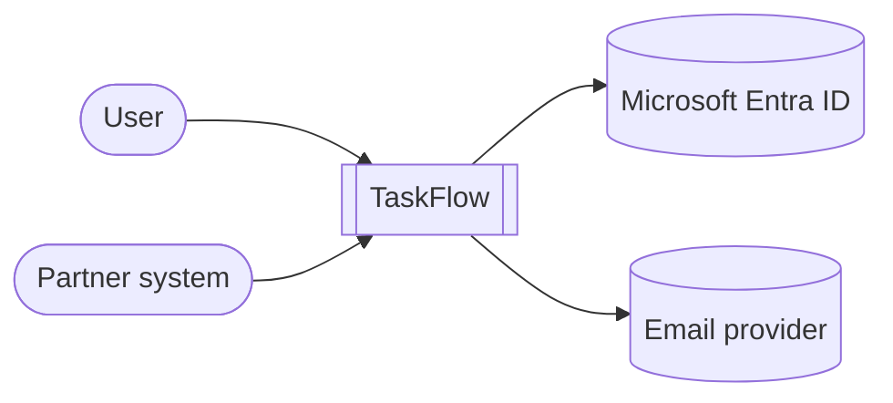

# Architecture

> Replace this template with your real diagrams and prose.

## 1. System Context (C4 L1)

## 2. Container (C4 L2)

(Insert refined version of the diagram from `01-Requirements-and-Architecture.md`.)

## 3. Component — Core API (C4 L3)

(One diagram showing Controllers → Application services → Domain → Infrastructure.)

## 4. Deployment (Azure)

(Resources, MGs, subscriptions, regions; show MI / KV / private endpoints.)

## 5. Key data flows

- **User login:** SPA → Front Door → BFF → Entra (Auth Code + PKCE) → BFF cookie back to SPA.
- **User reads tasks:** SPA → BFF → Core API (OBO) → SQL + Redis (cache-aside).
- **User assigns a task:** SPA → BFF → Core → SQL → publishes `TaskAssigned` to Service Bus → Worker → notification fan-out.
- **Partner reads tasks:** Partner → APIM (sub-key + JWT + rate-limit) → Core.

## 6. Cross-cutting concerns
- Multi-tenancy: every query filtered by `TenantId`; tested.
- Telemetry: correlation ID end-to-end; OpenTelemetry to App Insights.
- Security: MI everywhere; KV-only secrets; strict JWT validation; Defender + Policy.
